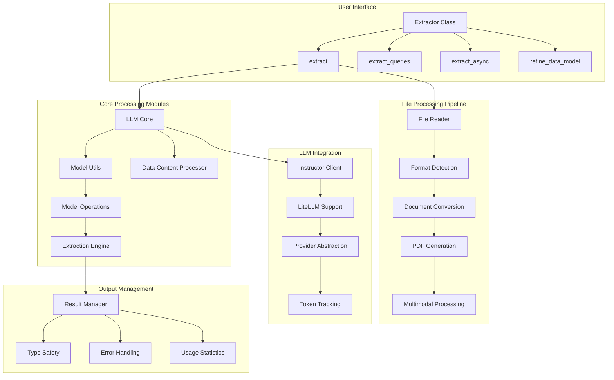

# Extractor

The `Extractor` class is the main interface for structured data extraction.

## API Requirements

**All methods require keyword arguments.** The `*` in method signatures indicates that all parameters after it must be passed as keyword arguments:

```python
# ✅ Correct usage
result = extractor.extract(data="file.pdf", query="extract information")
result = extractor.extract_queries(data="file.pdf", queries=["query1", "query2"])
model = extractor.get_schema(data="file.pdf", query="extract information")
refined = extractor.refine_data_model(model=ExistingModel, refinement_instructions="add field")

# ❌ Incorrect usage - will raise TypeError
result = extractor.extract("file.pdf", "extract information")
result = extractor.extract_queries("file.pdf", ["query1", "query2"])
```

## Architecture Overview

<details>
<summary>View Architecture Diagram</summary>



</details>

::: structx.Extractor
    options:
      show_bases: false
      heading_level: 2