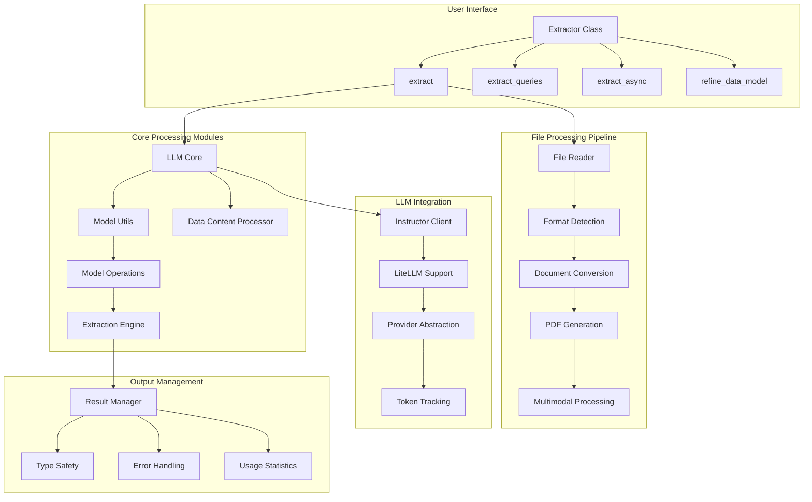

# Extractor

The `Extractor` class is the main interface for structured data extraction.

## Architecture Overview

```mermaid
graph TB
    subgraph "User Interface"
        A[Extractor Class]
        A1[extract] 
        A2[extract_queries]
        A3[extract_async]
        A4[refine_data_model]
    end
    
    subgraph "Core Processing Modules"
        B[LLM Core]
        C[Model Utils]
        D[Data Content Processor]
        E[Model Operations]
        F[Extraction Engine]
    end
    
    subgraph "File Processing Pipeline"
        G[File Reader]
        H[Format Detection]
        I[Document Conversion]
        J[PDF Generation]
        K[Multimodal Processing]
    end
    
    subgraph "LLM Integration"
        L[Instructor Client]
        M[LiteLLM Support]
        N[Provider Abstraction]
        O[Token Tracking]
    end
    
    subgraph "Output Management"
        P[Result Manager]
        Q[Type Safety]
        R[Error Handling]
        S[Usage Statistics]
    end
    
    A --> A1
    A --> A2
    A --> A3
    A --> A4
    
    A1 --> B
    A1 --> G
    B --> L
    G --> H
    H --> I
    I --> J
    J --> K
    
    B --> C
    B --> D
    C --> E
    E --> F
    F --> P
    
    L --> M
    M --> N
    N --> O
    P --> Q
    P --> R
    P --> S
```

::: structx.Extractor
    options:
      show_bases: false
      heading_level: 2