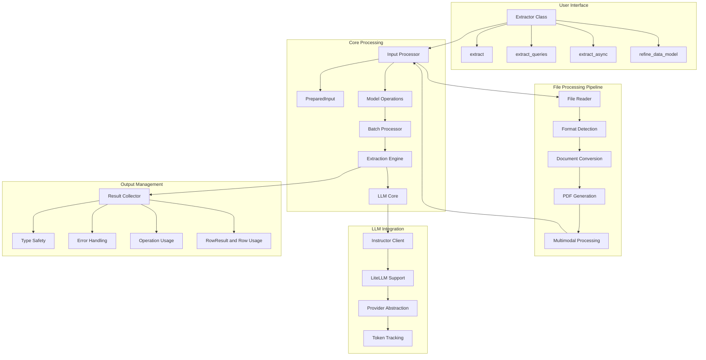

# Extractor

The `Extractor` class is the main interface for structured data extraction.

## Construction

`from_litellm()` is the recommended constructor. It creates both synchronous
and asynchronous Instructor clients, scopes provider settings to the extractor,
and enables LiteLLM's unsupported-parameter filtering:

```python
extractor = Extractor.from_litellm(
    model="openai/gpt-5.5",
    api_key="your-api-key",
    api_base="https://api.example.com/v1",
    planning_model="openai/gpt-4o",
)
```

Direct construction accepts a patched synchronous `Instructor` client. Pass an
`AsyncInstructor` through `async_client` as well if any async method will be
used. The async methods fail early when it is absent.

## API Requirements

**All public operation methods require keyword arguments.** The `*` in method
signatures indicates that all parameters after it must be passed by name:

```python
# Correct usage
result = extractor.extract(data="file.pdf", query="extract information")
result = extractor.extract_queries(data="file.pdf", queries=["query1", "query2"])
model = extractor.get_schema(data="file.pdf", query="extract information")
refined = extractor.refine_data_model(model=ExistingModel, refinement_instructions="add field")

# Incorrect usage - raises TypeError
result = extractor.extract("file.pdf", "extract information")
result = extractor.extract_queries("file.pdf", ["query1", "query2"])
```

## Architecture Overview

<details>
<summary>View Architecture Diagram</summary>


```mermaid
graph TB
    subgraph "User Interface"
        A[Extractor Class]
        A1[extract] 
        A2[extract_queries]
        A3[extract_async]
        A4[refine_data_model]
    end
    
    subgraph "Core Processing"
        B[LLM Core]
        C[Input Processor]
        C1[PreparedInput]
        D[Model Operations]
        E[Batch Processor]
        F[Extraction Engine]
    end
    
    subgraph "File Processing Pipeline"
        G[File Reader]
        H[Format Detection]
        I[Document Conversion]
        J[PDF Generation]
        K[Multimodal Processing]
    end
    
    subgraph "LLM Integration"
        L[Instructor Client]
        M[LiteLLM Support]
        N[Provider Abstraction]
        O[Token Tracking]
    end
    
    subgraph "Output Management"
        P[Result Collector]
        Q[Type Safety]
        R[Error Handling]
        S[Operation Usage]
        T[RowResult and Row Usage]
    end
    
    A --> A1
    A --> A2
    A --> A3
    A --> A4
    
    B --> L
    G --> H
    H --> I
    I --> J
    J --> K
    K --> C
    
    A --> C
    C --> C1
    C --> D
    C --> G
    D --> E
    E --> F
    F --> B
    F --> P
    
    L --> M
    M --> N
    N --> O
    P --> Q
    P --> R
    P --> S
    P --> T
```

</details>

For output semantics and row-level provenance, see
[Working with Results](../guides/working-with-results.md).

::: structx.Extractor
    options:
      show_bases: false
      heading_level: 2
