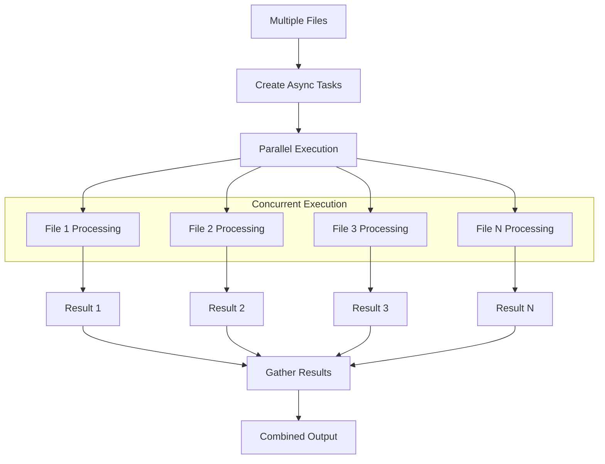

# Async Operations

`structx` provides asynchronous versions of all extraction methods for better
performance in async environments.

## Basic Async Extraction

```python
import asyncio

async def extract_data():
    result = await extractor.extract_async(
        data="scripts/example_input/free-consultancy-agreement.docx",
        query="extract the main parties and the effective date"
    )
    return result

# Run the async function
result = asyncio.run(extract_data())
```

## Async Methods

For each synchronous method, there is an async counterpart:

| Synchronous Method | Asynchronous Method     |
| ------------------ | ----------------------- |
| `extract`          | `extract_async`         |
| `extract_queries`  | `extract_queries_async` |
| `get_schema`       | `get_schema_async`      |

## Parallel Processing

Process multiple documents in parallel:

### Async Processing Flow

<details>
<summary>View Async Processing Flow Diagram</summary>



</details>

```python
import asyncio

async def process_documents(docs):
    tasks = []
    for doc_path, query in docs.items():
        task = extractor.extract_async(
            data=doc_path,
            query=query
        )
        tasks.append(task)

    results = await asyncio.gather(*tasks)
    return results

documents = {
    "scripts/example_input/free-consultancy-agreement.docx": "extract parties and governing law",
    "scripts/example_input/S0305SampleInvoice.pdf": "extract invoice number and total amount"
}
results = asyncio.run(process_documents(documents))
```

## Combining with Other Async Operations

```python
import asyncio
import aiofiles

async def read_and_extract(file_path, query):
    # Asynchronously read a file
    async with aiofiles.open(file_path, mode='r') as f:
        content = await f.read()

    # Extract information from the content
    result = await extractor.extract_async(
        data=content,
        query=query
    )

    return result

result = asyncio.run(read_and_extract("path/to/your/document.txt", "extract key details"))
```

## Async Multiple Queries

```python
import asyncio

async def process_multiple_queries():
    queries = [
        "extract all clauses related to payment",
        "extract termination conditions",
        "summarize the scope of services"
    ]

    results = await extractor.extract_queries_async(
        data="scripts/example_input/free-consultancy-agreement.docx",
        queries=queries
    )

    return results

results = asyncio.run(process_multiple_queries())
```

## Best Practices

1. **Use in Async Environments**: Only use async methods in async environments
2. **Limit Concurrency**: Be mindful of API rate limits when processing in
   parallel
3. **Handle Errors**: Use try/except with async operations
4. **Close Resources**: Ensure proper cleanup of resources in async contexts

## Next Steps

- Check out the [API Reference](../api/extractor.md) for detailed method
  signatures
- Try [Model Refinement](model-refinement.md) to enhance your data models
- Explore [Token Usage Tracking](token-tracking.md) to monitor resource
  consumption
- Learn about [retry mechanisms](retry-mechanism.md) for robust error handling
- See [Examples](../examples.md) for real-world use cases
