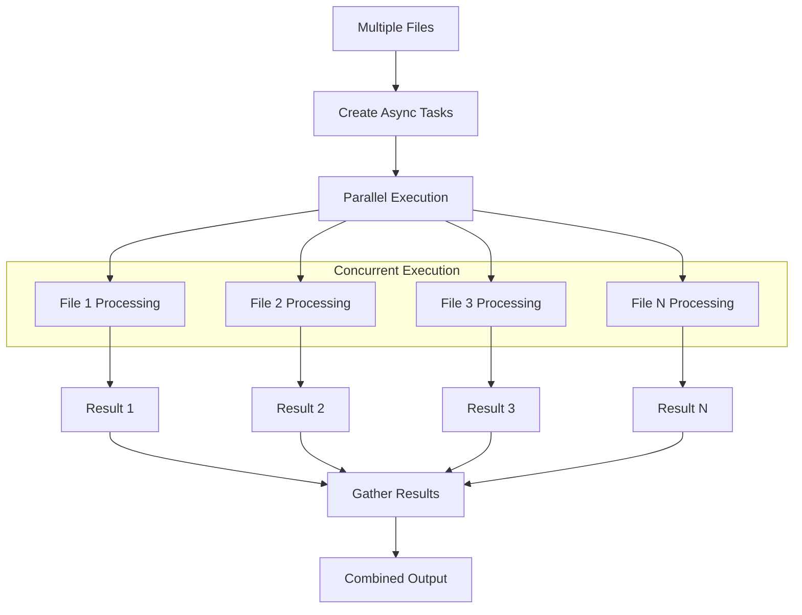

# Async Operations

`structx` provides asynchronous versions of all extraction methods for better
performance in async environments.

## Basic Async Extraction

```python
import asyncio

async def extract_data():
    result = await extractor.extract_async(
        data="document.pdf",
        query="extract key information"
    )
    return result

# Run the async function
result = asyncio.run(extract_data())
```

## Async Methods

For each synchronous method, there is an async counterpart:

| Synchronous Method | Asynchronous Method     |
| ------------------ | ----------------------- |
| `extract`          | `extract_async`         |
| `extract_queries`  | `extract_queries_async` |
| `get_schema`       | `get_schema_async`      |

## Parallel Processing

Process multiple files in parallel:

### Async Processing Flow



```python
import asyncio

async def process_files(files):
    tasks = []
    for file in files:
        task = extractor.extract_async(
            data=file,
            query="extract key information"
        )
        tasks.append(task)

    results = await asyncio.gather(*tasks)
    return results

files = ["file1.pdf", "file2.pdf", "file3.pdf"]
results = asyncio.run(process_files(files))
```

## Combining with Other Async Operations

```python
import asyncio
import aiohttp

async def fetch_and_extract():
    # Fetch data
    async with aiohttp.ClientSession() as session:
        async with session.get("https://example.com/data.json") as response:
            data = await response.text()

    # Extract information
    result = await extractor.extract_async(
        data=data,
        query="extract key information"
    )

    return result

result = asyncio.run(fetch_and_extract())
```

## Async Multiple Queries

```python
import asyncio

async def process_multiple_queries():
    queries = [
        "extract incident dates and times",
        "extract system components affected",
        "extract resolution steps"
    ]

    results = await extractor.extract_queries_async(
        data="document.pdf",
        queries=queries
    )

    return results

results = asyncio.run(process_multiple_queries())
```

## Best Practices

1. **Use in Async Environments**: Only use async methods in async environments
2. **Limit Concurrency**: Be mindful of API rate limits when processing in
   parallel
3. **Handle Errors**: Use try/except with async operations
4. **Close Resources**: Ensure proper cleanup of resources in async contexts

## Next Steps

- Check out the [API Reference](../api/extractor.md) for detailed method
  signatures
- Try [Model Refinement](model-refinement.md) to enhance your data models
- Explore [Token Usage Tracking](token-tracking.md) to monitor resource
  consumption
- Learn about [retry mechanisms](retry-mechanism.md) for robust error handling
- See [Examples](../examples.md) for real-world use cases
