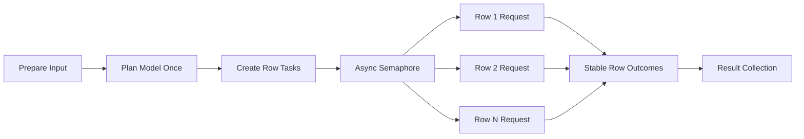

# Async Operations

`structx` uses LiteLLM's asynchronous completion API through an Instructor
`AsyncInstructor`. Planning and row extraction are native async model calls.
Blocking file parsing and document conversion are the only operations moved to
a worker thread.

`Extractor.from_litellm` configures both clients automatically. When creating
`Extractor` directly, pass both `client` and `async_client`; async methods fail
fast when no async Instructor client is configured.

## Basic Async Extraction

```python
import asyncio

async def extract_data():
    result = await extractor.extract_async(
        data="scripts/example_input/free-consultancy-agreement.docx",
        query="extract the main parties and the effective date"
    )
    return result

# Run the async function
result = asyncio.run(extract_data())
```

## Async Methods

For each synchronous method, there is an async counterpart:

| Synchronous Method | Asynchronous Method     |
| ------------------ | ----------------------- |
| `extract`          | `extract_async`         |
| `extract_queries`  | `extract_queries_async` |
| `get_schema`       | `get_schema_async`      |
| `refine_data_model` | `refine_data_model_async` |

## Parallel Processing

Process multiple documents in parallel:

### Async Processing Flow

<details>
<summary>View Async Processing Flow Diagram</summary>


```mermaid
graph LR
    A[Prepare Input] --> B[Plan Model Once]
    B --> C[Create Row Tasks]
    C --> D[Async Semaphore]
    D --> E1[Row 1 Request]
    D --> E2[Row 2 Request]
    D --> E3[Row N Request]
    E1 --> F[Stable Row Outcomes]
    E2 --> F
    E3 --> F
    F --> G[Result Collection]
```

</details>

```python
import asyncio

async def process_documents(docs):
    tasks = []
    for doc_path, query in docs.items():
        task = extractor.extract_async(
            data=doc_path,
            query=query
        )
        tasks.append(task)

    results = await asyncio.gather(*tasks)
    return results

documents = {
    "scripts/example_input/free-consultancy-agreement.docx": "extract parties and governing law",
    "scripts/example_input/S0305SampleInvoice.pdf": "extract invoice number and total amount"
}
results = asyncio.run(process_documents(documents))
```

## Combining with Other Async Operations

```python
import asyncio

async def fetch_and_extract(fetch_text, query):
    content = await fetch_text()
    return await extractor.extract_async(
        data=[{"text": content}],
        query=query
    )
```

## Async Multiple Queries

```python
import asyncio

async def process_multiple_queries():
    queries = [
        "extract all clauses related to payment",
        "extract termination conditions",
        "summarize the scope of services"
    ]

    results = await extractor.extract_queries_async(
        data="scripts/example_input/free-consultancy-agreement.docx",
        queries=queries
    )

    return results

results = asyncio.run(process_multiple_queries())
```

`extract_queries_async` prepares the input once and processes queries
sequentially. Rows within each query are concurrent. Keeping queries sequential
prevents query concurrency from multiplying row concurrency unexpectedly.

## Row Concurrency

Each row remains an independent model request. `max_threads` is also the maximum
number of in-flight async row requests for one extraction operation, while
`batch_size` limits how many row tasks are scheduled at once. Results are stored
by input position, so completion order does not affect output order or failure
attribution. Each `result.rows` entry retains its own usage object; the top-level
usage is merged in stable input order.

Rows are intentionally not combined into one prompt. Combining them would
require token-aware packing, generated row identifiers, partial-response
validation, and retrying only failed members of a combined call. It also lets
one oversized or malformed row invalidate unrelated rows. Independent requests
provide predictable limits, exact usage per call, and isolated retries.

Use separate `extract_async` tasks with `asyncio.gather` for independent
documents. Be aware that each operation has its own `max_threads` allowance.

## Best Practices

1. **Use in Async Environments**: Only use async methods in async environments
2. **Limit Concurrency**: Set `max_threads` to match provider rate limits
3. **Handle Errors**: Use try/except with async operations
4. **Close Resources**: Ensure proper cleanup of resources in async contexts

## Next Steps

- Check out the [API Reference](../api/extractor.md) for detailed method
  signatures
- Try [Model Refinement](model-refinement.md) to enhance your data models
- Explore [Token Usage Tracking](token-tracking.md) to monitor resource
  consumption
- Learn about [retry mechanisms](retry-mechanism.md) for robust error handling
- See [Examples](../examples.md) for real-world use cases
