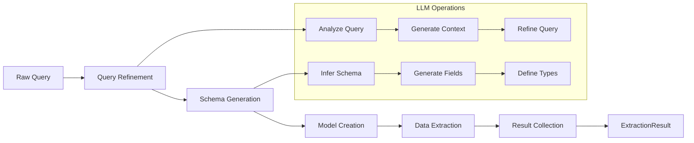
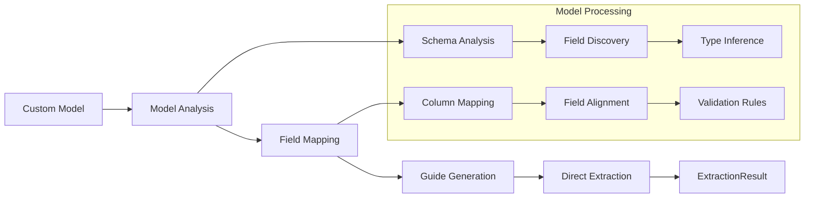

# Basic Extraction

This guide covers the fundamentals of data extraction with `structx`.

## Extraction Process

When you use `structx` to extract data, the following happens:

1. **Query Refinement**: The query is expanded and refined for better extraction
2. **Model Generation**: A Pydantic model is dynamically generated based on the
   query
3. **Data Extraction**: The model is used to extract structured data from the
   text
4. **Result Collection**: Results are collected and returned as an
   `ExtractionResult` object

### Standard Extraction Flow

<details>
<summary>View Standard Extraction Flow Diagram</summary>



</details>

### Simplified Workflow with Provided Model

When you provide a data model, the workflow is optimized:

1. **Model-Driven Guide Generation**: A guide is generated based on the model
   structure and available data columns
2. **Data Extraction**: The provided model is used to extract structured data
3. **Result Collection**: Results are collected and returned as an
   `ExtractionResult` object

This workflow is more efficient as it skips the query analysis step and uses the
model structure to guide the extraction process. The guide generation focuses on
mapping model fields to available data columns and ensuring proper data type
handling.

### Custom Model Flow

<details>
<summary>View Custom Model Flow Diagram</summary>



</details>

```python
from pydantic import BaseModel, Field
from typing import List

class Invoice(BaseModel):
    invoice_number: str = Field(..., description="The invoice number")
    total_amount: float = Field(..., description="The total amount of the invoice")
    line_items: List[str] = Field(..., description="A list of line items from the invoice")

# Extract using the provided model
result = extractor.extract(
    data="scripts/example_input/S0305SampleInvoice.pdf",
    model=Invoice
)
```

## Extraction Query

The extraction query is a natural language description of what you want to
extract. Be as specific as possible:

```python
# Simple query for a legal document
query = "extract the parties, effective date, and governing law"

# More specific query for an invoice
query = """
extract the following details from the invoice:
- invoice number
- total amount due
- list of all line items with their descriptions and costs
- payment due date
"""
```

## Input Data Types

`structx` supports various input data types, but for legal and financial
documents, you'll primarily use file paths.

### Files

```python
# PDF invoice
result = extractor.extract(
    data="scripts/example_input/S0305SampleInvoice.pdf",
    query="extract invoice number, total amount, and line items"
)

# DOCX contract
result = extractor.extract(
    data="scripts/example_input/free-consultancy-agreement.docx",
    query="extract the parties, effective date, and payment terms"
)
```

## Output Formats

### Model Instances (Default)

```python
result = extractor.extract(
    data="scripts/example_input/S0305SampleInvoice.pdf",
    query="extract invoice number and total amount",
)

# Access as list of model instances
for item in result.data:
    print(f"Invoice Number: {item.invoice_number}")
    print(f"Total Amount: {item.total_amount}")
```

### DataFrame

```python
result = extractor.extract(
    data="scripts/example_input/S0305SampleInvoice.pdf",
    query="extract invoice number and total amount",
    return_df=True
)

# Access as DataFrame
print(result.data.head())
```

### Nested Data

For nested data structures, you can choose to flatten them:

```python
result = extractor.extract(
    data=df,
    query="extract incident dates and affected systems",
    return_df=True,
    expand_nested=True  # Flatten nested structures
)
```

## Working with Results

The `extract` method returns an `ExtractionResult` object with:

- `data`: Extracted data (DataFrame or list of model instances)
- `failed`: DataFrame with failed extractions
- `model`: Generated or provided model class
- `success_count`: Number of successful extractions
- `failure_count`: Number of failed extractions
- `success_rate`: Success rate as a percentage

```python
# Check extraction statistics
print(f"Extracted {result.success_count} items")
print(f"Failed {result.failure_count} items")
print(f"Success rate: {result.success_rate:.1f}%")

# Access the model schema
print(result.model.model_json_schema())
```

## Error Handling

Failed extractions are collected in the `failed` DataFrame:

```python
if result.failure_count > 0:
    print("Failed extractions:")
    print(result.failed)
```

## Next Steps

- Learn about [Custom Models](custom-models.md) for specific extraction needs
- Try [Model Refinement](model-refinement.md) to modify data models with natural
  language
- Learn about [retry mechanisms](retry-mechanism.md) for robust error handling
- Explore [Unstructured Text](unstructured-text.md) handling for documents
- See how to use [Multiple Queries](multiple-queries.md) for complex extractions
