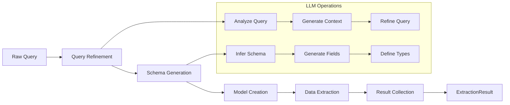
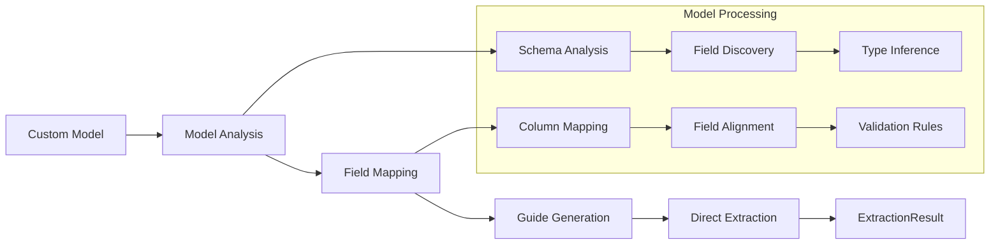

# Basic Extraction

This guide covers the fundamentals of data extraction with `structx`.

## Extraction Process

When you use `structx` to extract data, the following happens:

1. **Query Refinement**: The query is expanded and refined for better extraction
2. **Model Generation**: A Pydantic model is dynamically generated based on the
   query
3. **Data Extraction**: The model is used to extract structured data from the
   text
4. **Result Collection**: Results are collected and returned as an
   `ExtractionResult` object

### Standard Extraction Flow



### Simplified Workflow with Provided Model

When you provide a data model, the workflow is optimized:

1. **Model-Driven Guide Generation**: A guide is generated based on the model
   structure and available data columns
2. **Data Extraction**: The provided model is used to extract structured data
3. **Result Collection**: Results are collected and returned as an
   `ExtractionResult` object

This workflow is more efficient as it skips the query analysis step and uses the
model structure to guide the extraction process. The guide generation focuses on
mapping model fields to available data columns and ensuring proper data type
handling.

### Custom Model Flow



```python
from pydantic import BaseModel

class Incident(BaseModel):
    date: str
    system: str
    severity: str

# Extract using the provided model
result = extractor.extract(
    data=df,
    query="extract incident details",
    model=Incident
)
```

## Extraction Query

The extraction query is a natural language description of what you want to
extract. Be as specific as possible:

```python
# Simple query
query = "extract incident dates and affected systems"

# More specific query
query = """
extract incident information including:
- date and time of occurrence
- affected system components
- severity level (high, medium, low)
- resolution steps taken
"""
```

## Input Data Types

`structx` supports various input data types:

### DataFrames

```python
import pandas as pd

df = pd.DataFrame({
    "description": [
        "System check on 2024-01-15 detected high CPU usage (92%) on server-01.",
        "Database backup failure occurred on 2024-01-20 03:00."
    ]
})

result = extractor.extract(
    data=df,
    query="extract incident dates and affected systems"
)
```

### Files

```python
# CSV files
result = extractor.extract(
    data="logs.csv",
    query="extract incident dates and affected systems"
)

# Excel files
result = extractor.extract(
    data="reports.xlsx",
    query="extract incident dates and affected systems"
)

# JSON files
result = extractor.extract(
    data="data.json",
    query="extract incident dates and affected systems"
)
```

### Raw Text

```python
text = """
System check on 2024-01-15 detected high CPU usage (92%) on server-01.
Database backup failure occurred on 2024-01-20 03:00.
"""

result = extractor.extract(
    data=text,
    query="extract incident dates and affected systems"
)
```

## Output Formats

### Model Instances (Default)

```python
result = extractor.extract(
    data=df,
    query="extract incident dates and affected systems",
    return_df=False  # Default
)

# Access as list of model instances
for item in result.data:
    print(f"Date: {item.incident_date}")
    print(f"System: {item.affected_system}")
```

### DataFrame

```python
result = extractor.extract(
    data=df,
    query="extract incident dates and affected systems",
    return_df=True
)

# Access as DataFrame
print(result.data.head())
```

### Nested Data

For nested data structures, you can choose to flatten them:

```python
result = extractor.extract(
    data=df,
    query="extract incident dates and affected systems",
    return_df=True,
    expand_nested=True  # Flatten nested structures
)
```

## Working with Results

The `extract` method returns an `ExtractionResult` object with:

- `data`: Extracted data (DataFrame or list of model instances)
- `failed`: DataFrame with failed extractions
- `model`: Generated or provided model class
- `success_count`: Number of successful extractions
- `failure_count`: Number of failed extractions
- `success_rate`: Success rate as a percentage

```python
# Check extraction statistics
print(f"Extracted {result.success_count} items")
print(f"Failed {result.failure_count} items")
print(f"Success rate: {result.success_rate:.1f}%")

# Access the model schema
print(result.model.model_json_schema())
```

## Error Handling

Failed extractions are collected in the `failed` DataFrame:

```python
if result.failure_count > 0:
    print("Failed extractions:")
    print(result.failed)
```

## Next Steps

- Learn about [Custom Models](custom-models.md) for specific extraction needs
- Try [Model Refinement](model-refinement.md) to modify data models with natural
  language
- Learn about [retry mechanisms](retry-mechanism.md) for robust error handling
- Explore [Unstructured Text](unstructured-text.md) handling for documents
- See how to use [Multiple Queries](multiple-queries.md) for complex extractions
