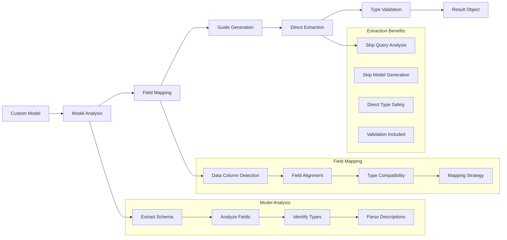

# Custom Models

While `structx` dynamically generates models based on your queries, you can also
use your own custom Pydantic models for extraction.

## Custom Model Processing Flow

<details>
<summary>View Custom Model Processing Flow Diagram</summary>



</details>

## Using Custom Models

### Define Your Model

```python
from pydantic import BaseModel, Field
from typing import List, Optional, date

class Party(BaseModel):
    name: str = Field(description="Name of the party")
    role: str = Field(description="Role of the party (e.g., Client, Consultant)")

class ConsultancyAgreement(BaseModel):
    parties: List[Party] = Field(description="The parties to the agreement")
    effective_date: date = Field(description="The effective date of the agreement")
    governing_law: str = Field(description="The governing law of the agreement")

class Invoice(BaseModel):
    invoice_number: str = Field(description="The invoice number")
    total_amount: float = Field(description="The total amount of the invoice")
    issue_date: date = Field(description="The date the invoice was issued")
```

### Extract with Custom Model

```python
# Extract from a legal document
result = extractor.extract(
    data="scripts/example_input/free-consultancy-agreement.docx",
    model=ConsultancyAgreement
)

# Access the extracted data
for agreement in result.data:
    print(f"Agreement effective date: {agreement.effective_date}")
    for party in agreement.parties:
        print(f"- Party: {party.name} ({party.role})")
    print(f"Governing Law: {agreement.governing_law}")

# Extract from an invoice
result_invoice = extractor.extract(
    data="scripts/example_input/S0305SampleInvoice.pdf",
    model=Invoice
)

for invoice in result_invoice.data:
    print(f"Invoice Number: {invoice.invoice_number}")
    print(f"Total Amount: {invoice.total_amount}")
    print(f"Issue Date: {invoice.issue_date}")
```

## Reusing Generated Models

You can also reuse models generated from previous extractions:

```python
# First extraction generates a model for a contract
result1 = extractor.extract(
    data="scripts/example_input/free-consultancy-agreement.docx",
    query="extract parties and effective date"
)

# Reuse the model for another contract
result2 = extractor.extract(
    data="another_contract.docx",
    model=result1.model
)
```

## Generating Models Without Extraction

You can generate a model without performing extraction using `get_schema`:

```python
# Generate a model based on a query and a sample from a legal document
LegalClauseModel = extractor.get_schema(
    query="extract the termination clause, including notice period and conditions",
    data="scripts/example_input/free-consultancy-agreement.docx"
)

# Inspect the model
print(LegalClauseModel.model_json_schema())

# Use the model for extraction
result = extractor.extract(
    data="scripts/example_input/free-consultancy-agreement.docx",
    model=LegalClauseModel
)
```

## Extending Generated Models

You can extend generated models with additional fields or validation:

For more advanced model modifications, you can also use the
[Model Refinement](model-refinement.md) feature to update your models using
natural language instructions:

```python
# Generate a base model
ContractModel = extractor.get_schema(
    query="extract parties and effective date",
    data="scripts/example_input/free-consultancy-agreement.docx"
)

# Refine it with natural language
EnhancedContractModel = extractor.refine_data_model(
    model=ContractModel,
    instructions="""
    1. Add a 'governing_law' field of type string.
    2. Add a 'termination_notice_days' field of type integer.
    3. Make the 'parties' field a list of strings.
    """
)

# check token usage
usage = EnhancedContractModel.usage
print(f"Total tokens used: {usage.total_tokens}")
print(f"By step: {[(s.name, s.tokens) for s in usage.steps]}")
```

## Model Validation

Pydantic models provide built-in validation:

```python
# Create an instance with validation
try:
    agreement = ConsultancyAgreement(
        parties=[{"name": "Client Corp", "role": "Client"}, {"name": "Consultant LLC", "role": "Consultant"}],
        effective_date="2025-01-01",
        governing_law="State of Delaware"
    )
    print("Valid agreement:", agreement)
except Exception as e:
    print("Validation error:", e)
```

## Best Practices

1. **Add Field Descriptions**: Always include descriptions for your fields to
   guide the extraction
2. **Use Type Hints**: Proper type hints help ensure correct extraction
3. **Set Default Values**: Use defaults for optional fields
4. **Add Validation**: Include validation rules for better data quality
5. **Keep Models Focused**: Create models that focus on specific extraction
   tasks

## Next Steps

- Learn about [Model Refinement](model-refinement.md) for updating models with
  natural language
- Explore [Unstructured Text](unstructured-text.md) handling
- See how to use [Multiple Queries](multiple-queries.md) for complex extractions
- Try [Async Operations](async-operations.md) for better performance
