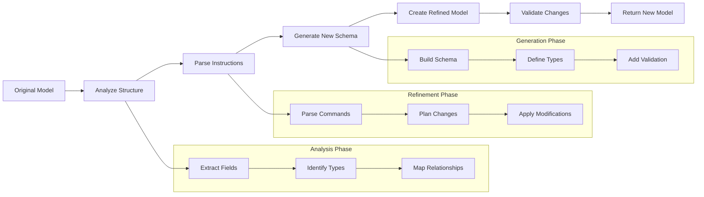

# Using Model Refinement

The `refine_data_model` feature allows you to modify existing Pydantic models
using natural language instructions. This powerful capability lets you evolve
your data models as requirements change without having to manually rewrite them.

## Basic Usage

```python
from structx import Extractor
from pydantic import BaseModel, Field
from typing import List, date

# Initialize the extractor
extractor = Extractor.from_litellm(
    model="gpt-4o",
    api_key="your-api-key"
)

# Original model for a legal contract
class Contract(BaseModel):
    parties: List[str]
    effective_date: date

# Refine the model
refined_model = extractor.refine_data_model(
    model=Contract,
    instructions="""
    1. Change 'parties' to a list of objects, each with 'name' and 'role' fields.
    2. Add a 'governing_law' string field.
    3. Add a 'termination_notice_days' integer field with a default of 30.
    """,
    model_name="EnhancedContract"  # Optional custom name
)

# Create an instance of the refined model
contract_instance = refined_model(
    parties=[{"name": "Client Corp", "role": "Client"}, {"name": "Consultant LLC", "role": "Consultant"}],
    effective_date="2025-01-01",
    governing_law="State of Delaware"
)

print(contract_instance)
```

## How It Works

The `refine_data_model` method:

### Model Refinement Process

<details>
<summary>View Model Refinement Process Diagram</summary>



</details>

The `refine_data_model` method:

1. Takes an existing Pydantic model and natural language instructions
2. Analyzes the model structure and the requested changes
3. Generates a new model with the specified modifications
4. Ensures proper validation rules are applied
5. Returns the refined model ready for use

## Example Use Cases

### Adding New Fields to an Invoice Model

```python
class Invoice(BaseModel):
    invoice_number: str
    total_amount: float

enhanced_invoice = extractor.refine_data_model(
    model=Invoice,
    instructions="Add a 'due_date' of type date and a 'line_items' field that is a list of strings."
)
```

### Modifying Field Types and Validation in a Legal Document Model

```python
class LegalClause(BaseModel):
    clause_title: str
    clause_text: str

validated_clause = extractor.refine_data_model(
    model=LegalClause,
    instructions="""
    1. Add a 'clause_id' that must start with 'CL-'.
    2. Ensure 'clause_title' is not empty.
    3. Add a 'tags' field which is a list of strings.
    """
)
```

### Removing Fields from a Party Model

```python
class Party(BaseModel):
    name: str
    address: str
    contact_person: str
    role: str

simplified_party = extractor.refine_data_model(
    model=Party,
    instructions="Remove the 'address' and 'contact_person' fields."
)
```

### Complex Transformations on a Financial Model

```python
class Financials(BaseModel):
    revenue: float
    expenses: float

detailed_financials = extractor.refine_data_model(
    model=Financials,
    instructions="""
    1. Split 'expenses' into 'operating_expenses' and 'capital_expenditures'.
    2. Add a 'profit' field that should be calculated as revenue - (operating_expenses + capital_expenditures).
    3. Add a 'currency' field that defaults to 'USD'.
    """
)
```

## Best Practices

### Provide Clear Instructions

Be specific about what changes you want to make. Include:

- Fields to add, modify, or remove
- Validation requirements
- Type changes
- Default values if needed

### Validate the Results

Always check the generated model to ensure it meets your requirements:

```python
# Print the model schema
print(refined_model.model_json_schema())

# Test with valid and invalid data
try:
    invalid_contract = refined_model(
        parties=[{"name": "Test"}], # Missing role
        effective_date="2025-01-01",
        governing_law="State of Delaware"
    )
except ValueError as e:
    print(f"Validation works: {e}")
```

### Provide Context When Needed

For complex refinements, providing context helps the model understand your
intent:

```python
refined_invoice = extractor.refine_data_model(
    model=Invoice,
    instructions="""
    Context: We are updating our invoicing system for international clients.

    Changes needed:
    1. Add a 'currency' field, which must be a 3-letter ISO code.
    2. Add a 'vat_number' field, which is optional.
    3. Ensure 'total_amount' is always a positive number.
    """
)
```

## Advanced Features

### Custom Model Names

You can specify a custom name for the refined model:

```python
SubContractorAgreement = extractor.refine_data_model(
    model=Contract,
    instructions="Add a 'primary_contractor' field.",
    model_name="SubContractorAgreement"
)
```

### Working with Nested Models

The refinement process can handle nested models:

```python
class LineItem(BaseModel):
    description: str
    amount: float

class Invoice(BaseModel):
    invoice_number: str
    line_items: List[LineItem]

enhanced_invoice = extractor.refine_data_model(
    model=Invoice,
    instructions="""
    1. Add a 'quantity' integer field to the LineItem model.
    2. Add a 'client_name' string field to the Invoice model.
    """
)
```

## Limitations

- Complex custom validators might need manual adjustment
- Very specialized domain-specific validations may require additional guidance
- The quality of the refinement depends on the clarity of your instructions

## Conclusion

Model refinement provides a powerful way to evolve your data models using
natural language. It's particularly useful for:

- Rapid prototyping
- Adapting models to changing requirements
- Adding validation without manual coding
- Exploring different model structures

By combining the flexibility of natural language with the type safety of
Pydantic, `refine_data_model` helps you maintain robust data models with minimal
effort.

## Next Steps

- Learn about [Token Usage Tracking](../guides/token-tracking.md) to monitor
  resource consumption
- Explore [Custom Models](../guides/custom-models.md) for creating specialized
  extraction models
- Try [Multiple Queries](../guides/multiple-queries.md) for complex extraction
  scenarios
- See how to use [Async Operations](../guides/async-operations.md) for better
  performance
