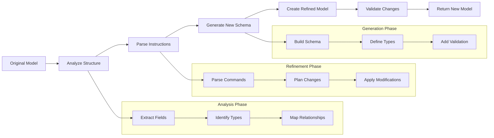

# Using Model Refinement

The `refine_data_model` feature allows you to modify existing Pydantic models
using natural language instructions. This powerful capability lets you evolve
your data models as requirements change without having to manually rewrite them.

## Basic Usage

```python
from structx import Extractor
from pydantic import BaseModel

# Initialize the extractor
extractor = Extractor.from_litellm(
    model="gpt-4o",
    api_key="your-api-key"
)

# Original model
class UserProfile(BaseModel):
    name: str
    email: str
    age: int

# Refine the model
refined_model = extractor.refine_data_model(
    model=UserProfile,
    instructions="""
    1. Add a 'phone_number' field as a string in the format '123-456-7890'
    2. Change 'age' to 'birth_date' using datetime type
    3. Add validation to ensure email contains '@'
    """,
    model_name="EnhancedUserProfile"  # Optional custom name
)

# Create an instance of the refined model
user = refined_model(
    name="John Doe",
    email="john@example.com",
    birth_date="1990-01-01",
    phone_number="123-456-7890"
)

print(user)
# EnhancedUserProfile(name='John Doe', email='john@example.com', birth_date=datetime.datetime(1990, 1, 1, 0, 0), phone_number='123-456-7890')
```

## How It Works

The `refine_data_model` method:

### Model Refinement Process



The `refine_data_model` method:

1. Takes an existing Pydantic model and natural language instructions
2. Analyzes the model structure and the requested changes
3. Generates a new model with the specified modifications
4. Ensures proper validation rules are applied
5. Returns the refined model ready for use

## Example Use Cases

### Adding New Fields

```python
class Product(BaseModel):
    name: str
    price: float
    category: str

enhanced_product = extractor.refine_data_model(
    model=Product,
    instructions="Add an 'in_stock' boolean field and a 'tags' field that accepts a list of strings"
)

# Result: Product with name, price, category, in_stock, and tags fields
```

### Modifying Field Types and Validation

```python
class Order(BaseModel):
    id: str
    items: List[str]
    total: float

validated_order = extractor.refine_data_model(
    model=Order,
    instructions="""
    1. Make 'id' follow the pattern 'ORD-' followed by 6 digits
    2. Change 'items' to accept a list of dictionaries with 'product_id' and 'quantity' fields
    3. Ensure 'total' is always positive
    """
)

# Result: Order with validated id, structured items list, and positive total
```

### Removing Fields

```python
class UserSettings(BaseModel):
    user_id: str
    preferences: Dict[str, str]
    last_login: datetime
    created_at: datetime
    updated_at: datetime

simplified_settings = extractor.refine_data_model(
    model=UserSettings,
    instructions="Remove the 'created_at' and 'updated_at' fields"
)

# Result: UserSettings without created_at and updated_at fields
```

### Complex Transformations

```python
class SimpleAddress(BaseModel):
    street: str
    city: str
    country: str

detailed_address = extractor.refine_data_model(
    model=SimpleAddress,
    instructions="""
    1. Split 'street' into 'street_name' and 'street_number'
    2. Add a 'postal_code' field with appropriate validation for postal codes
    3. Add a 'state_province' field that's required for US and Canada but optional otherwise
    4. Make 'country' use a two-letter country code format
    """
)

# Result: A more detailed address model with proper validation
```

## Best Practices

### Provide Clear Instructions

Be specific about what changes you want to make. Include:

- Fields to add, modify, or remove
- Validation requirements
- Type changes
- Default values if needed

### Validate the Results

Always check the generated model to ensure it meets your requirements:

```python
# Print the model schema
print(refined_model.model_json_schema())

# Test with valid and invalid data
try:
    invalid_user = refined_model(
        name="John Doe",
        email="invalid-email",  # Missing '@'
        birth_date="1990-01-01",
        phone_number="123-456-7890"
    )
except ValueError as e:
    print(f"Validation works: {e}")
```

### Provide Context When Needed

For complex refinements, providing context helps the model understand your
intent:

```python
medical_record = extractor.refine_data_model(
    model=PatientRecord,
    instructions="""
    Context: We're updating our medical records system to comply with new regulations.

    Changes needed:
    1. Add a 'consent_given' boolean field that defaults to False
    2. Make 'patient_id' follow the new format 'PAT-' followed by 8 digits
    3. Add an 'emergency_contact' field with name and phone number
    4. Ensure all dates use ISO format
    """
)
```

## Advanced Features

### Custom Model Names

You can specify a custom name for the refined model:

```python
admin_user = extractor.refine_data_model(
    model=User,
    instructions="Add admin-specific fields like 'permissions' and 'access_level'",
    model_name="AdminUser"
)
```

### Working with Nested Models

The refinement process can handle nested models:

```python
class Address(BaseModel):
    street: str
    city: str
    country: str

class Person(BaseModel):
    name: str
    address: Address

enhanced_person = extractor.refine_data_model(
    model=Person,
    instructions="""
    1. Add 'email' and 'phone' fields to the Person model
    2. Add 'postal_code' to the nested Address model
    """
)
```

## Limitations

- Complex custom validators might need manual adjustment
- Very specialized domain-specific validations may require additional guidance
- The quality of the refinement depends on the clarity of your instructions

## Conclusion

Model refinement provides a powerful way to evolve your data models using
natural language. It's particularly useful for:

- Rapid prototyping
- Adapting models to changing requirements
- Adding validation without manual coding
- Exploring different model structures

By combining the flexibility of natural language with the type safety of
Pydantic, `refine_data_model` helps you maintain robust data models with minimal
effort.

## Next Steps

- Learn about [Token Usage Tracking](../guides/token-tracking.md) to monitor
  resource consumption
- Explore [Custom Models](../guides/custom-models.md) for creating specialized
  extraction models
- Try [Multiple Queries](../guides/multiple-queries.md) for complex extraction
  scenarios
- See how to use [Async Operations](../guides/async-operations.md) for better
  performance
