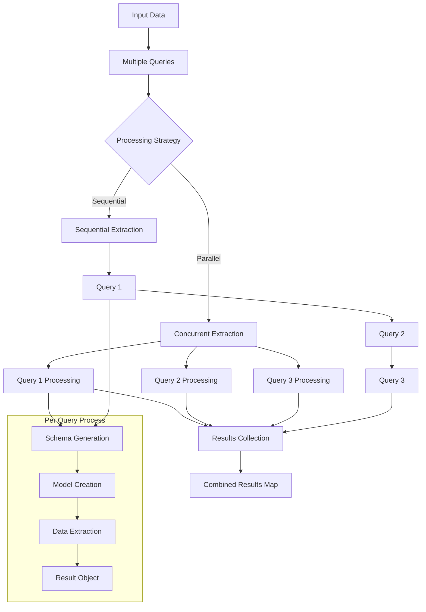

# Multiple Queries

When you need to extract different types of information from the same data,
`structx` provides the `extract_queries` method to process multiple queries
efficiently.

## Processing Flow

<details>
<summary>View Multiple Queries Processing Flow Diagram</summary>



</details>

## Basic Usage

```python
# Define multiple queries for a legal document
queries = [
    "extract the parties involved, including their names and roles",
    "extract all important dates, such as effective date and termination date",
    "extract the payment terms, including amounts and schedules"
]

# Process all queries on the same document
results = extractor.extract_queries(
    data="scripts/example_input/free-consultancy-agreement.docx",
    queries=queries
)

# Access results by query
for query, result in results.items():
    print(f"\nResults for query: '{query}'")
    print(f"Extracted {result.success_count} items with {result.success_rate:.1f}% success rate")

    # Access the data
    for item in result.data:
        print(item.model_dump_json(indent=2))

    # Access the model
    print(f"Model used: {result.model.__name__}")
```

## Return Format Options

Just like with single queries, you can control the return format:

```python
# Return as DataFrames
results = extractor.extract_queries(
    data="scripts/example_input/S0305SampleInvoice.pdf",
    queries=["extract invoice number and total", "extract line items"],
    return_df=True
)
```

## Async Processing

For better performance, you can use the async version:

```python
import asyncio

async def process_queries():
    queries = [
        "extract client and consultant details",
        "summarize the scope of services"
    ]
    results = await extractor.extract_queries_async(
        data="scripts/example_input/free-consultancy-agreement.docx",
        queries=queries
    )
    return results

results = asyncio.run(process_queries())
```

## Benefits of Multiple Queries

Using `extract_queries` has several advantages over making separate calls:

1. **Efficiency**: The document is loaded and preprocessed only once.
2. **Consistency**: All queries operate on the exact same version of the
   document.
3. **Organization**: Results are neatly organized by the query that produced
   them.
4. **Performance**: Better resource utilization, especially with async
   operations.

## Use Cases

### Different Aspects of a Legal Document

```python
queries = [
    "extract all clauses related to intellectual property",
    "extract confidentiality obligations for both parties",
    "extract liability and indemnification clauses"
]
```

### Different Levels of Detail from an Invoice

```python
queries = [
    "extract high-level summary: invoice number, total amount, due date",
    "extract detailed line items with descriptions, quantities, and prices",
    "extract payment instructions and bank details"
]
```

### Different Entity Types from a Contract

```python
queries = [
    "extract information about all parties (names, addresses, roles)",
    "extract all defined terms and their definitions",
    "extract all monetary values and their context"
]
```

## Next Steps

- Learn about [Async Operations](async-operations.md) for better performance
- Try [Model Refinement](model-refinement.md) to enhance your data models
- Explore the [API Reference](../api/extractor.md) for more details
- Check out the [Examples](../examples.md) for real-world use cases
