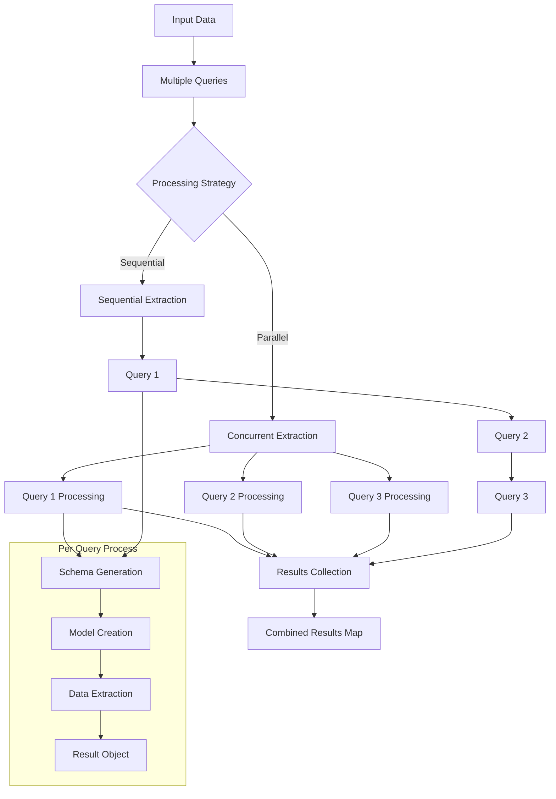

# Multiple Queries

When you need to extract different types of information from the same data,
`structx` provides the `extract_queries` method to process multiple queries
efficiently.

## Processing Flow



## Basic Usage

```python
# Define multiple queries
queries = [
    "extract incident dates and times",
    "extract system components affected",
    "extract resolution steps"
]

# Process all queries on the same data
results = extractor.extract_queries(
    data="incident_report.txt",
    queries=queries
)

# Access results by query
for query, result in results.items():
    print(f"\nResults for query: {query}")
    print(f"Extracted {result.success_count} items with {result.success_rate:.1f}% success rate")

    # Access the data
    for item in result.data:
        print(item.model_dump_json())

    # Access the model
    print(f"Model: {result.model.__name__}")
```

## Return Format Options

Just like with single queries, you can control the return format:

```python
# Return as DataFrames
results = extractor.extract_queries(
    data=df,
    queries=queries,
    return_df=True
)

# With expanded nested structures
results = extractor.extract_queries(
    data=df,
    queries=queries,
    return_df=True,
    expand_nested=True
)
```

## Async Processing

For better performance, you can use the async version:

```python
import asyncio

async def process_queries():
    results = await extractor.extract_queries_async(
        data="large_document.pdf",
        queries=queries
    )
    return results

results = asyncio.run(process_queries())
```

## Benefits of Multiple Queries

Using `extract_queries` has several advantages over making separate calls:

1. **Efficiency**: The data is loaded only once
2. **Consistency**: All queries use the same data preprocessing
3. **Organization**: Results are organized by query
4. **Performance**: Better resource utilization

## Use Cases

### Different Aspects of the Same Data

```python
queries = [
    "extract temporal information (dates, times, durations)",
    "extract technical details (systems, components, metrics)",
    "extract impact information (severity, affected users, business impact)"
]
```

### Different Levels of Detail

```python
queries = [
    "extract high-level summary of incidents",
    "extract detailed technical information about each incident",
    "extract specific metrics and measurements"
]
```

### Different Entity Types

```python
queries = [
    "extract information about people mentioned",
    "extract information about systems mentioned",
    "extract information about locations mentioned"
]
```

## Next Steps

- Learn about [Async Operations](async-operations.md) for better performance
- Try [Model Refinement](model-refinement.md) to enhance your data models
- Explore the [API Reference](../api/extractor.md) for more details
- Check out the [Examples](../examples.md) for real-world use cases
