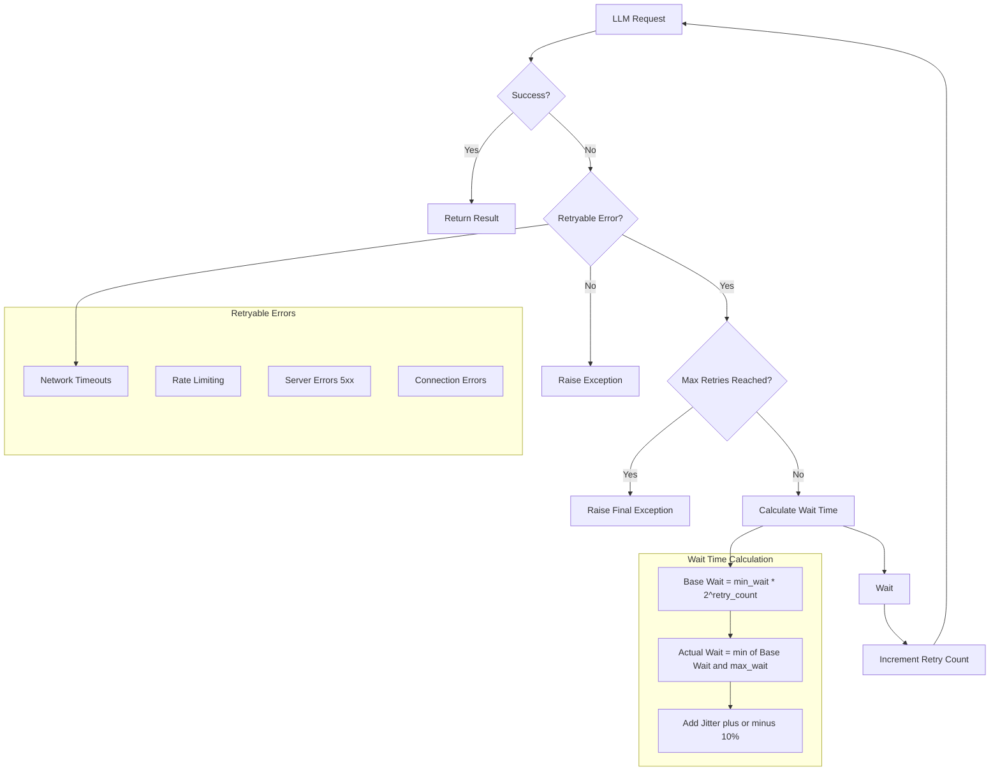

# Retry Mechanism

`structx` includes a robust retry mechanism with exponential backoff to handle
transient errors when communicating with LLM providers.

## Basic Usage

The retry mechanism is enabled by default with sensible defaults:

```python
extractor = Extractor.from_litellm(
    model="gpt-4o",
    api_key="your-api-key"
    # Default retry settings:
    # max_retries=3, min_wait=1, max_wait=10
)
```

## Customizing Retry Behavior

You can customize the retry behavior when initializing the extractor:

```python
extractor = Extractor.from_litellm(
    model="gpt-4o",
    api_key="your-api-key",
    max_retries=5,      # Maximum number of retry attempts
    min_wait=2,         # Minimum seconds to wait between retries
    max_wait=30         # Maximum seconds to wait between retries
)
```

## How It Works

The retry mechanism uses exponential backoff, which means:

1. First retry: Wait `min_wait` seconds
2. Second retry: Wait twice as long
3. Subsequent retries: Continue doubling the wait time up to `max_wait`

This approach helps prevent overwhelming the API during temporary outages and
gives the service time to recover.

### Retry Flow



## Retry-Eligible Errors

The retry mechanism automatically handles:

- Network timeouts
- Rate limiting errors
- Temporary server errors
- Connection issues

Critical errors like authentication failures or invalid inputs are not retried
as they require manual intervention.

## Monitoring Retries

You can monitor retry attempts through the logs:

```python
import logging
from loguru import logger

# Configure more verbose logging
logger.remove()
logger.add(sys.stderr, level="DEBUG")

# Now extraction calls will show retry attempts in the logs
result = extractor.extract(data, query)
```

## Retry with Async Operations

The retry mechanism works seamlessly with async operations:

```python
import asyncio

async def extract_with_retry():
    result = await extractor.extract_async(
        data="document.pdf",
        query="extract key information"
    )
    return result

# The same retry settings apply to async operations
result = asyncio.run(extract_with_retry())
```

## Next Steps

- Check out [Token Usage Tracking](token-tracking.md) to monitor resource
  consumption
- Learn about [Async Operations](async-operations.md) for better performance
- Explore [Error Handling](../reference/error-handling.md) for more details on
  handling errors
- See the [Configuration Options](../reference/configuration-options.md) for all
  available settings
