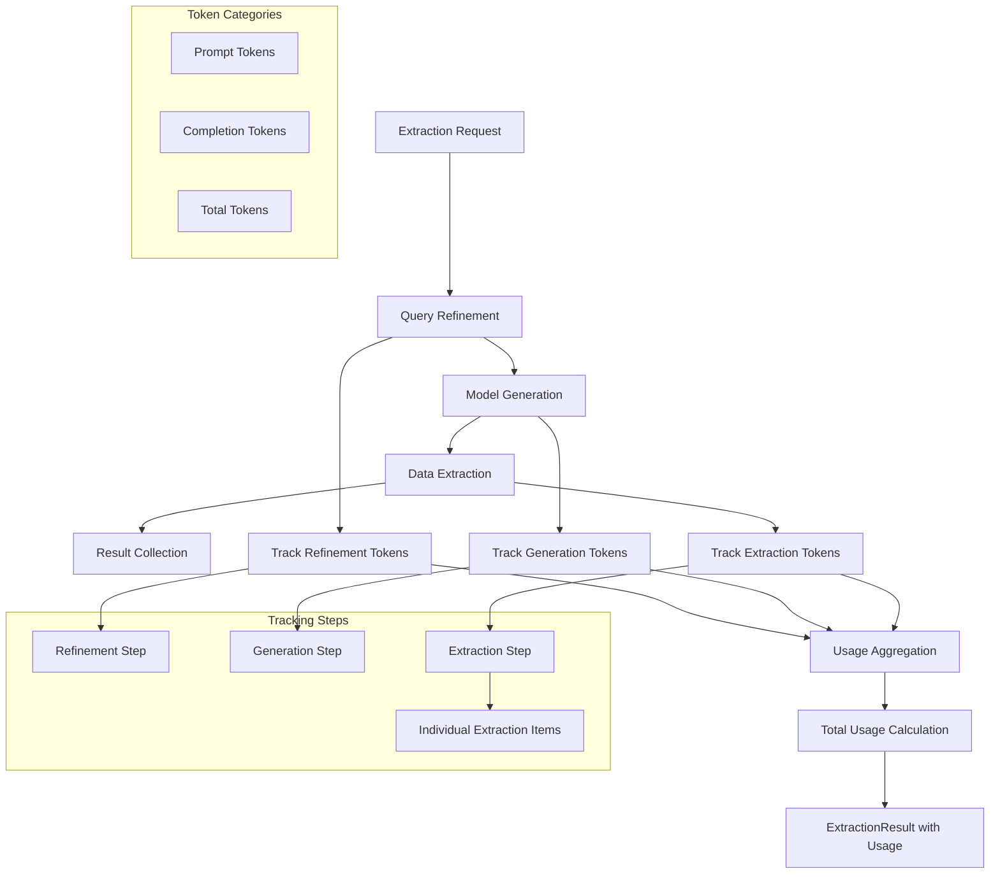

# Token Usage Tracking

`structx` provides detailed token usage tracking across all steps of the
extraction process, helping you monitor costs and optimize your queries.

## Token Tracking Flow



## Basic Usage

```python
from structx import Extractor

# Initialize extractor
extractor = Extractor.from_litellm(
    model="gpt-4o",
    api_key="your-api-key"
)

# Extract structured data
result = extractor.extract(
    data="incident_report.txt",
    query="extract incident details"
)

# Access token usage information
usage = result.get_token_usage()
if usage:
    print(f"Total tokens used: {usage.total_tokens}")
    print(f"Prompt tokens: {usage.prompt_tokens}")
    print(f"Completion tokens: {usage.completion_tokens}")

    # Print usage by step
    for step in usage.steps:
        print(f"{step.name}: {step.tokens} tokens")
```

## Detailed Token Information

For more detailed information about extraction steps, use the `detailed`
parameter:

```python
# Get detailed token usage with extraction breakdowns
detailed_usage = result.get_token_usage(detailed=True)

# Access extraction details
extraction = next((s for s in detailed_usage.steps if s.name == "extraction"), None)
if extraction and hasattr(extraction, "steps"):
    print(f"Number of extraction steps: {len(extraction.steps)}")
    for i, step in enumerate(extraction.steps):
        print(f"  Extraction {i+1}: {step.tokens} tokens")
```

## Understanding the Steps

Token usage is tracked across four main steps:

1. **Refinement**: Refining and expanding the query for better extraction
   (skipped if a model is provided)
2. **Guide Generation**: Generating a guide for the extraction process
3. **Schema Generation**: Generating the data model for extraction (skipped if a
   model is provided)
4. **Extraction**: Performing the actual data extraction (potentially multiple
   calls)

## Token Usage with Multiple Queries

When using multiple queries, token usage is tracked for each query
independently:

```python
queries = ["extract dates", "extract names", "extract organizations"]
results = extractor.extract_queries(data="document.txt", queries=queries)

for query, result in results.items():
    usage = result.get_token_usage()
    if usage:
        print(f"Query: {query}")
        print(f"Total tokens: {usage.total_tokens}")
```

## Advanced Metrics

Some LLM providers offer additional metrics like thinking tokens or cached
tokens. These metrics are included when available:

```python
if usage.thinking_tokens:
    print(f"Thinking tokens: {usage.thinking_tokens}")

if usage.cached_tokens:
    print(f"Cached tokens: {usage.cached_tokens}")
```

## Usage with Model Refinement

Token usage is also tracked when [refining data models](model-refinement.md)

```python
from pydantic import BaseModel

class User(BaseModel):
    name: str
    age: int

enhanced_user = extractor.refine_data_model(
    model=User,
    instructions="Add email and address fields, with validation for email format"
)

# Access token usage information
usage = enhanced_user.usage.get_usage_summary()
print(f"Token usage for model refinement: {usage.total_tokens}")
```

## Understanding Token Costs

Different LLM providers charge differently for tokens:

- **Prompt tokens**: Text sent to the model (typically less expensive)
- **Completion tokens**: Text generated by the model (typically more expensive)

By tracking both prompt and completion tokens separately, `structx` helps you
understand your costs more precisely.

## Next Steps

- Learn about the [Retry Mechanism](retry-mechanism.md) for handling transient
  errors
- Explore [Async Operations](async-operations.md) for better performance
- Check out [Error Handling](../reference/error-handling.md) for more details on
  handling errors
- See the [Configuration Options](../reference/configuration-options.md) for all
  available settings
