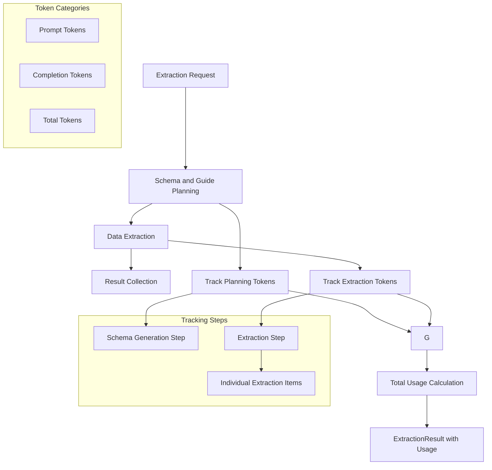

# Token Usage Tracking

`structx` provides detailed token usage tracking across all steps of the
extraction process, helping you monitor costs and optimize your queries.

## Token Tracking Flow

<details>
<summary>View Token Tracking Flow</summary>


```mermaid
graph TD
    A[Extraction Request] --> B[Schema and Guide Planning]
    B --> D[Data Extraction]
    D --> E[Result Collection]

    B --> F2[Track Planning Tokens]
    D --> F3[Track Extraction Tokens]

    F2 --> G
    F3 --> G

    G --> H[Total Usage Calculation]
    H --> I[ExtractionResult with Usage]

    subgraph "Token Categories"
        J[Prompt Tokens]
        K[Completion Tokens]
        L[Total Tokens]
    end

    subgraph "Tracking Steps"
        N[Schema Generation Step]
        O[Extraction Step]
        P[Individual Extraction Items]
    end

    F2 --> N
    F3 --> O
    O --> P
```

</details>

## Basic Usage

```python
from structx import Extractor

# Initialize extractor
extractor = Extractor.from_litellm(
    model="gpt-4o",
    api_key="your-api-key"
)

# Extract structured data
result = extractor.extract(
    data="incident_report.txt",
    query="extract incident details"
)

# Access token usage information
usage = result.usage
if usage:
    print(f"Total tokens used: {usage.total_tokens}")
    print(f"Prompt tokens: {usage.prompt_tokens}")
    print(f"Completion tokens: {usage.completion_tokens}")

    # Inspect the original provider usage objects by step
    for step, calls in usage.steps.items():
        print(step.value, [call.total_tokens for call in calls])
```

## Detailed Token Information

Each step contains the original usage object returned by LiteLLM. Values are
always lists because a step may make more than one model call:

```python
from structx.utils.usage import ExtractionStep

extraction_calls = usage.get_step(ExtractionStep.EXTRACTION)
for call_usage in extraction_calls:
    print(call_usage.model_dump())
```

## Understanding the Steps

The summary contains only model-backed steps that actually ran:

1. **Schema Generation**: Performs planning, including schema or extraction
   guide generation depending on whether a custom model was supplied.
2. **Extraction**: Performs the actual extraction, potentially across multiple
   calls.

## Token Usage with Multiple Queries

When using multiple queries, token usage is tracked for each query
independently:

```python
queries = ["extract dates", "extract names", "extract organizations"]
results = extractor.extract_queries(data="document.txt", queries=queries)

for query, result in results.items():
    usage = result.usage
    if usage:
        print(f"Query: {query}")
        print(f"Total tokens: {usage.total_tokens}")
```

## Advanced Metrics

Some LLM providers offer additional metrics like thinking tokens or cached
tokens. These metrics are included when available:

```python
if usage.thinking_tokens:
    print(f"Thinking tokens: {usage.thinking_tokens}")

if usage.cached_tokens:
    print(f"Cached tokens: {usage.cached_tokens}")
```

These values remain `None` when the provider or OpenAI-compatible proxy does not
include the corresponding token details in its response.

Structx retains each provider usage object without translating it into a
separate token schema. This includes metrics specific to LiteLLM or the
underlying provider:

```python
from structx.utils.usage import ExtractionStep

schema_calls = usage.get_step(ExtractionStep.SCHEMA_GENERATION)
if schema_calls:
    raw_usage = schema_calls[0]
    print(raw_usage.completion_tokens_details.reasoning_tokens)
```

## Usage with Model Refinement

Token usage is also tracked when [refining data models](model-refinement.md)

```python
from pydantic import BaseModel

class User(BaseModel):
    name: str
    age: int

enhanced_user = extractor.refine_data_model(
    model=User,
    refinement_instructions="Add email and address fields, with validation for email format"
)

# Access token usage information
usage = enhanced_user.usage
print(f"Token usage for model refinement: {usage.total_tokens}")
```

## Understanding Token Costs

Different LLM providers charge differently for tokens:

- **Prompt tokens**: Text sent to the model (typically less expensive)
- **Completion tokens**: Text generated by the model (typically more expensive)

By tracking both prompt and completion tokens separately, `structx` helps you
understand your costs more precisely.

## Next Steps

- Learn about the [Retry Mechanism](retry-mechanism.md) for handling transient
  errors
- Explore [Async Operations](async-operations.md) for better performance
- Check out [Error Handling](../reference/error-handling.md) for more details on
  handling errors
- See the [Configuration Options](../reference/configuration-options.md) for all
  available settings
