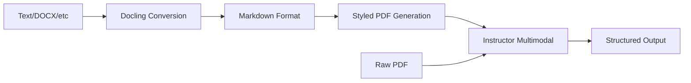
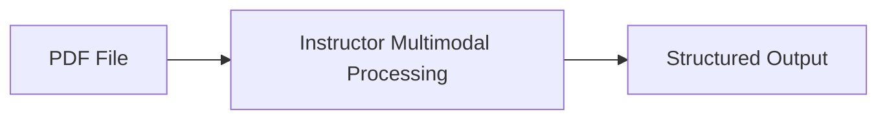

# Unstructured Text

`structx` supports extracting structured data from various unstructured text
sources, including PDF documents, text files, and raw text. The library uses a
unified approach that converts all unstructured documents to PDF and leverages
instructor's multimodal PDF support for optimal context preservation and
extraction quality.

## Installation Options

### Basic Installation

```bash
pip install structx-llm
```

### With Enhanced Document Processing (Recommended)

For the best experience with unstructured documents, install with PDF conversion
and document processing support:

```bash
# Complete document processing support (recommended)
pip install structx-llm[docs]

# Individual components
pip install structx-llm[pdf]     # PDF conversion and processing
pip install structx-llm[docx]    # DOCX support via docling
```

### Required Dependencies for Multimodal Processing

The default multimodal PDF processing approach requires these packages:

- **weasyprint**: For PDF generation from HTML/markdown
- **markdown**: For markdown processing
- **docling** (optional): For advanced DOCX conversion
- **PyPDF2** (fallback): For simple PDF text extraction

These are automatically installed with the `[docs]` extra.

## Processing Approach

### Unified PDF Processing (Default)

`structx` uses an innovative unified approach for all unstructured documents
that provides superior extraction quality:

#### How It Works

1. **Smart Conversion**: All unstructured documents (TXT, DOCX, etc.) are
   intelligently converted to PDF format
2. **Multimodal Processing**: Uses instructor's native multimodal PDF support
   for extraction
3. **Context Preservation**: Eliminates chunking issues and preserves full
   document layout and context
4. **Automatic Fallback**: Falls back to simple text processing if PDF
   conversion fails

#### Technical Pipeline

<details>
<summary>View Technical Pipeline Diagram</summary>



</details>

#### Default Usage

```python
# Process a DOCX contract by converting it to PDF for optimal extraction
result = extractor.extract(
    data="scripts/example_input/free-consultancy-agreement.docx", # Converted to PDF -> multimodal
    query="extract the parties, effective date, and payment terms"
)

# PDFs are processed directly with multimodal support
result = extractor.extract(
    data="scripts/example_input/S0305SampleInvoice.pdf",          # Direct multimodal processing
    query="extract the invoice number, total amount, and line items"
)
```

## Working with Different File Types

### Text Files (.txt, .md, .log, .py, .html, .xml, .rst)

Text files are converted to professionally styled PDFs and processed with
multimodal support:

```python
# Extract from a markdown file (converted to styled PDF)
result = extractor.extract(
    data="README.md",
    query="extract installation instructions and requirements"
)

# Extract from log files (converted to PDF with monospace formatting)
result = extractor.extract(
    data="system.log",
    query="extract error events and timestamps"
)

# Extract from code files (converted to PDF with syntax highlighting)
result = extractor.extract(
    data="script.py",
    query="extract function names and their purposes"
)
```

### PDF Documents (.pdf)

PDF documents are processed directly with instructor's multimodal support:

```python
# Extract from PDF (direct multimodal processing - no conversion needed)
result = extractor.extract(
    data="contract.pdf",
    query="extract parties, dates, and payment terms"
)

# Works with complex PDFs including tables, images, and layouts
result = extractor.extract(
    data="financial_report.pdf",
    query="extract financial metrics and performance indicators"
)
```

### Word Documents (.docx, .doc)

DOCX files use the advanced docling → markdown → PDF conversion pipeline:

```python
# Extract from DOCX (docling → markdown → styled PDF → multimodal)
result = extractor.extract(
    data="project_proposal.docx",
    query="extract project timeline, budget, and deliverables"
)

# Preserves document structure including tables and formatting
result = extractor.extract(
    data="meeting_notes.docx",
    query="extract action items and responsible parties"
)
```

### Raw Text Strings

Raw text can be processed by creating a temporary PDF:

```python
text = """
Incident Report #2024-001
Date: January 15, 2024
System: Production Server-01
Issue: High CPU usage detected at 92%
Resolution: Memory leak patched, monitoring increased
"""

result = extractor.extract(
    data=text,
    query="extract incident details including ID, date, system, and resolution"
)
```

## Processing Options and Parameters

### Default Multimodal Processing

The default approach provides the best results for most use cases:

```python
# Default: multimodal PDF processing (recommended)
result = extractor.extract(
    data="document.docx",
    query="extract key information"
    # mode="multimodal_pdf" is default
    # use_multimodal=True is default
)
```

### Alternative Processing Modes

For specific requirements or troubleshooting, alternative modes are available:

#### Simple Text Processing

Process files as plain text with basic chunking (fallback mode, not
recommended):

```python
result = extractor.extract(
    data="document.txt",
    query="extract key information",
    mode="simple_text",           # Override default
    chunk_size=1500,             # Custom chunk size
    chunk_overlap=300            # Custom overlap
)
```

#### Simple PDF Processing

Basic PDF text extraction without multimodal features:

```python
result = extractor.extract(
    data="document.pdf",
    query="extract key information",
    mode="simple_pdf",           # Basic PDF text extraction
    chunk_size=2000,
    chunk_overlap=200
)
```

### File Reading Options

You can pass additional options for file processing:

```python
result = extractor.extract(
    data="document.csv",
    query="extract key information",
    file_options={
        "encoding": "utf-8",     # For text files
        "sep": ";",              # For CSV files
        "sheet_name": "Data"     # For Excel files
    }
)
```

### Processing Parameters Reference

| Parameter        | Type | Default          | Description                                                    |
| ---------------- | ---- | ---------------- | -------------------------------------------------------------- |
| `mode`           | str  | "multimodal_pdf" | Processing mode: "multimodal_pdf", "simple_text", "simple_pdf" |
| `use_multimodal` | bool | True             | Enable multimodal processing (legacy parameter)                |
| `chunk_size`     | int  | 1000             | Text chunk size (only for fallback simple modes)               |
| `chunk_overlap`  | int  | 200              | Overlap between chunks (only for fallback simple modes)        |
| `file_options`   | dict | {}               | Additional file reading options (encoding, separators, etc.)   |

## Supported File Formats

| Format  | Extension             | Processing Method            | Description                    |
| ------- | --------------------- | ---------------------------- | ------------------------------ |
| CSV     | .csv                  | Direct pandas processing     | Structured data, no conversion |
| Excel   | .xlsx, .xls           | Direct pandas processing     | Structured data, no conversion |
| JSON    | .json                 | Direct pandas processing     | Structured data, no conversion |
| Parquet | .parquet              | Direct pandas processing     | Structured data, no conversion |
| Feather | .feather              | Direct pandas processing     | Structured data, no conversion |
| Text    | .txt, .md, .log, etc. | Convert to PDF → Multimodal  | Unified PDF processing         |
| PDF     | .pdf                  | Direct multimodal processing | Native instructor support      |
| Word    | .docx, .doc           | Convert to PDF → Multimodal  | Via docling → markdown → PDF   |

## Conversion Pipeline Details

The library uses sophisticated conversion pipelines optimized for different
document types:

### Text Files → PDF Pipeline

<details>
<summary>View Text Files to PDF Pipeline Diagram</summary>


</details>

**Supported Extensions**: `.txt`, `.md`, `.py`, `.html`, `.xml`, `.log`, `.rst`

1. **Content Reading**: Direct file reading with UTF-8 encoding
2. **Markdown Processing**: Enhanced markdown conversion with syntax
   highlighting
3. **Styled PDF Generation**: Professional PDF with appropriate fonts and
   formatting
4. **Multimodal Processing**: Instructor's vision-enabled extraction

### DOCX Files → PDF Pipeline

<details>
<summary>View DOCX Files to PDF Pipeline Diagram</summary>


</details>

**Supported Extensions**: `.docx`, `.doc`

1. **Docling Conversion**: Advanced document structure analysis
2. **Markdown Export**: Preserves tables, formatting, and structure
3. **Enhanced HTML**: Professional styling with proper typography
4. **PDF Generation**: High-quality PDF with maintained layout
5. **Multimodal Processing**: Full context extraction

### PDF Files → Direct Processing

<details>
<summary>View PDF Files to Direct Processing Diagram</summary>



</details>

**Supported Extensions**: `.pdf`

- **Direct Processing**: No conversion required
- **Native Support**: Full instructor multimodal capabilities
- **Optimal Performance**: No preprocessing overhead

### Fallback Text Processing

When PDF conversion fails or is disabled:

<details>
<summary>View Fallback Text Processing Diagram</summary>


</details>

1. **Text Extraction**: Format-specific text extraction
2. **Smart Chunking**: Overlap-based chunking with context preservation
3. **Text Processing**: Traditional text-based extraction

## Best Practices

### Optimal Results Strategy

1. **Use Default Settings**: The multimodal PDF approach provides superior
   extraction quality compared to text-based methods
2. **Install Complete Dependencies**: Use `pip install structx-llm[docs]` for
   full functionality
3. **Craft Specific Queries**: Take advantage of preserved document context and
   layout information
4. **Trust the Pipeline**: The conversion process is optimized for extraction
   quality, not file size

### Document-Specific Recommendations

#### PDF Documents

- **Direct Processing**: PDFs get the best results as no conversion is needed
- **Complex Layouts**: Tables, charts, and multi-column layouts are handled
  natively
- **Large Files**: Multimodal processing handles large PDFs without chunking
  issues

#### Text Files

- **Markdown Advantage**: Markdown files get enhanced formatting in the PDF
  conversion
- **Code Files**: Syntax highlighting is preserved in the converted PDF
- **Log Files**: Monospace formatting aids in structured data extraction

#### DOCX Files

- **Structure Preservation**: Tables, headings, and formatting are maintained
  through docling
- **Complex Documents**: Multi-section documents with varied formatting work
  well
- **Template Documents**: Forms and structured documents extract reliably

### Advanced Optimization Techniques

#### Memory Management

```python
# For very large documents, consider processing in smaller sections
# or using simple modes if memory is constrained
result = extractor.extract(
    data="huge_document.pdf",
    query="extract specific section data",
    # Consider simple_pdf mode for memory-constrained environments
)
```

#### Batch Processing

```python
# Process multiple documents individually for best results
documents = ["doc1.pdf", "doc2.docx", "doc3.txt"]

results = []
for doc in documents:
    result = extractor.extract(
        data=doc,
        query="extract key information"
    )
    results.append(result)
```

#### Query Optimization

```python
# Take advantage of full document context
result = extractor.extract(
    data="contract.pdf",
    query="""Extract all contract details including:
    - Party names and addresses
    - Contract dates (start, end, signature)
    - Payment terms and amounts
    - Key obligations and deliverables
    - Termination clauses"""
)
```

## Practical Examples

### Example 1: Contract Analysis

```python
# Extract comprehensive contract information from a PDF
result = extractor.extract(
    data="service_agreement.pdf",
    query="""Extract the following contract details:
    - Contracting parties (names, roles, addresses)
    - Contract effective date and duration
    - Service descriptions and deliverables
    - Payment terms, amounts, and schedules
    - Key obligations for each party
    - Termination conditions and notice periods
    - Governing law and dispute resolution"""
)

# Access extracted data
for contract in result.data:
    print(f"Contract between: {contract.parties}")
    print(f"Effective: {contract.effective_date}")
    print(f"Services: {contract.services}")
```

### Example 2: Technical Documentation Processing

```python
# Extract API documentation from markdown files
result = extractor.extract(
    data="api_docs.md",
    query="""Extract API endpoint information:
    - Endpoint URLs and HTTP methods
    - Required and optional parameters
    - Request/response examples
    - Authentication requirements
    - Rate limiting information
    - Error codes and descriptions"""
)
```

### Example 3: Financial Report Analysis

```python
# Process quarterly reports from DOCX files
result = extractor.extract(
    data="Q4_financial_report.docx",
    query="""Extract financial metrics and insights:
    - Revenue figures by quarter and year-over-year
    - Profit margins and operating expenses
    - Key performance indicators (KPIs)
    - Market outlook and forward guidance
    - Risk factors and mitigation strategies
    - Executive summary highlights"""
)
```

### Example 4: Log File Analysis

```python
# Analyze system logs for incidents
result = extractor.extract(
    data="system_logs.log",
    query="""Extract system incidents and events:
    - Error events with timestamps and severity
    - System performance metrics and alerts
    - User activities and authentication events
    - Network connectivity issues
    - Hardware or software failures
    - Recovery actions and resolutions"""
)
```

### Troubleshooting

#### Common Issues and Solutions

1. **PDF Conversion Failures**

   ```python
   # If conversion fails, the library automatically falls back to simple text
   # You can also force simple text mode:
   result = extractor.extract(
       data="problematic_document.docx",
       query="extract information",
       mode="simple_text"  # Skip PDF conversion
   )
   ```

2. **Missing Dependencies**

   ```bash
   # Install complete document processing support
   pip install structx-llm[docs]

   # Or install specific components
   pip install weasyprint markdown docling PyPDF2
   ```

3. **Memory Issues with Large Documents**

   ```python
   # Use simple processing for very large files
   result = extractor.extract(
       data="large_document.pdf",
       query="extract key information",
       mode="simple_pdf",     # Reduce memory usage
       chunk_size=1500,       # Smaller chunks
       chunk_overlap=150      # Reduced overlap
   )
   ```

4. **DOCX Processing Issues**

   ```python
   # If docling conversion fails, fallback is automatic
   # You can check what processing method was used:

   # Check the DataFrame structure after reading
   df = extractor.extract(data="document.docx", query="test")
   print(df.columns)  # Will show processing method used
   ```

#### Debug Mode

Enable detailed logging to troubleshoot processing issues:

```python
import logging
from loguru import logger

# Enable debug logging
logger.add("extraction_debug.log", level="DEBUG")

result = extractor.extract(
    data="problematic_document.pdf",
    query="extract information"
)
```

#### Performance Diagnostics

```python
import time

start_time = time.time()
result = extractor.extract(
    data="document.pdf",
    query="extract information"
)
processing_time = time.time() - start_time

print(f"Processing time: {processing_time:.2f} seconds")
print(f"Success rate: {result.success_rate:.1f}%")
print(f"Items extracted: {result.success_count}")
```

### Performance Optimization

1. **Multimodal First**: Always try multimodal processing first - it typically
   provides the best results
2. **Batch Processing**: For multiple documents, process them individually for
   best results
3. **Query Optimization**: Craft specific queries that take advantage of full
   document context

## Next Steps

- Learn about [Multiple Queries](multiple-queries.md) for extracting different
  types of information
- Try [Model Refinement](model-refinement.md) to enhance your extraction models
- Explore [Async Operations](async-operations.md) for processing large documents
  efficiently
- See the [API Reference](../api/extractor.md) for all available options
