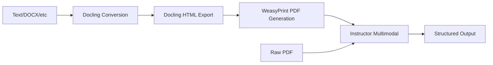
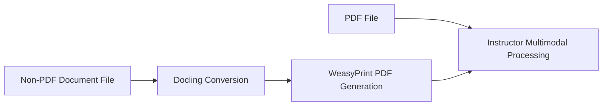

# Unstructured Text

`structx` supports extracting structured data from unstructured text sources,
PDF documents, and supported document files. The base install stays light for
structured and text/table extraction; install `structx[docs]` to enable the
multimodal document pipeline.

## Installation Options

!!! info "Package rename notice (PyPI)"
    The PyPI distribution has been renamed from `structx-llm` to `structx` (September 2025).

    - Imports are unchanged: `import structx`
    - Document processing lives in the optional `docs` extra
    - To upgrade:

        ```bash
        pip uninstall -y structx-llm
        pip install -U structx
        ```

    If you pinned `structx-llm` in requirements or lock files, replace it with `structx`.
    For PDF and document processing, install `structx[docs]`.

### Basic Installation

```bash
pip install structx
```

### Document Processing Installation

```bash
pip install "structx[docs]"
```

The optional document pipeline includes these packages:

- **docling-slim**: For non-PDF document parsing and HTML export
- **weasyprint**: For PDF generation from Docling HTML
- **torch / torchvision**: Required by Docling's local model pipeline

With uv on Linux, the project resolves CPU-only PyTorch wheels.

## Processing Approach

### Multimodal PDF Processing

`structx[docs]` uses multimodal extraction for document-like inputs:

#### How It Works

1. **PDF Passthrough**: Existing PDFs are sent directly to multimodal extraction
2. **Smart Conversion**: Supported non-PDF documents (TXT, DOCX, etc.) are
   converted to PDF format
3. **Multimodal Processing**: Uses instructor's native multimodal PDF support
   for extraction
4. **Context Preservation**: Eliminates chunking issues and preserves full
   document layout and context

#### Technical Pipeline

<details>
<summary>View Technical Pipeline Diagram</summary>


```mermaid
graph LR
    A[Text/DOCX/etc] --> B[Docling Conversion]
    B --> C[Docling HTML Export]
    C --> D[WeasyPrint PDF Generation]
    D --> E[Instructor Multimodal]
    E --> F[Structured Output]

    G[Raw PDF] --> E
```

</details>

#### Default Usage

```python
# Process a DOCX contract through the document multimodal pipeline
result = extractor.extract(
    data="scripts/example_input/free-consultancy-agreement.docx",
    query="extract the parties, effective date, and payment terms"
)

# PDFs are passed directly to multimodal extraction
result = extractor.extract(
    data="scripts/example_input/S0305SampleInvoice.pdf",
    query="extract the invoice number, total amount, and line items"
)
```

## Working with Different File Types

### Text Files (.txt, .md, .log, .py, .html, .xml, .rst)

Text files require `structx[docs]`; they are parsed with Docling, rendered to
PDFs, and processed with multimodal support:

```python
# Extract from a markdown file
result = extractor.extract(
    data="README.md",
    query="extract installation instructions and requirements"
)

# Extract from log files
result = extractor.extract(
    data="system.log",
    query="extract error events and timestamps"
)

# Extract from code files
result = extractor.extract(
    data="script.py",
    query="extract function names and their purposes"
)
```

### PDF Documents (.pdf)

PDF documents require `structx[docs]`; they are passed directly to multimodal
extraction:

```python
# Extract from PDF
result = extractor.extract(
    data="contract.pdf",
    query="extract parties, dates, and payment terms"
)

# Works with complex PDFs including tables, images, and layouts
result = extractor.extract(
    data="financial_report.pdf",
    query="extract financial metrics and performance indicators"
)
```

### Word Documents (.docx, .doc)

DOCX files require `structx[docs]` and use the Docling → HTML → PDF conversion
pipeline:

```python
# Extract from DOCX (Docling → HTML → PDF → multimodal)
result = extractor.extract(
    data="project_proposal.docx",
    query="extract project timeline, budget, and deliverables"
)

# Preserves document structure including tables and formatting
result = extractor.extract(
    data="meeting_notes.docx",
    query="extract action items and responsible parties"
)
```

### Raw Text Strings

Raw text can be processed by creating a temporary PDF:

```python
text = """
Incident Report #2024-001
Date: January 15, 2024
System: Production Server-01
Issue: High CPU usage detected at 92%
Resolution: Memory leak patched, monitoring increased
"""

result = extractor.extract(
    data=text,
    query="extract incident details including ID, date, system, and resolution"
)
```

## Processing Options and Parameters

### Default Multimodal Processing

The default approach provides the best results for most use cases:

```python
# Default: multimodal PDF processing (recommended)
result = extractor.extract(
    data="document.docx",
    query="extract key information"
)
```

### File Reading Options

You can pass additional pandas options for structured files:

```python
result = extractor.extract(
    data="document.csv",
    query="extract key information",
    file_options={
        "encoding": "utf-8",     # For text files
        "sep": ";",              # For CSV files
        "sheet_name": "Data"     # For Excel files
    }
)
```

### Processing Parameters Reference

| Parameter        | Type | Default          | Description                                                    |
| ---------------- | ---- | ---------------- | -------------------------------------------------------------- |
| `file_options`   | dict | {}               | Additional pandas options for structured file readers          |

## Supported File Formats

| Format  | Extension             | Processing Method            | Description                    |
| ------- | --------------------- | ---------------------------- | ------------------------------ |
| CSV     | .csv                  | Direct pandas processing     | Structured data, no conversion |
| Excel   | .xlsx, .xls           | Direct pandas processing     | Structured data, no conversion |
| JSON    | .json                 | Direct pandas processing     | Structured data, no conversion |
| Parquet | .parquet              | Direct pandas processing     | Structured data, no conversion |
| Feather | .feather              | Direct pandas processing     | Structured data, no conversion |
| Text    | .txt, .md, .log, etc. | Docling → HTML → PDF → Multimodal | Requires `structx[docs]`      |
| PDF     | .pdf                  | PDF → Multimodal                  | Requires `structx[docs]`      |
| Word    | .docx, .doc           | Docling → HTML → PDF → Multimodal | Requires `structx[docs]`      |
| PowerPoint | .pptx, .ppt        | Docling → HTML → PDF → Multimodal | Requires `structx[docs]`      |

## Conversion Pipeline Details

The document pipeline passes PDFs through directly and converts supported
non-PDF document-like inputs:

### Document Files → PDF Pipeline

<details>
<summary>View Document to PDF Pipeline Diagram</summary>


```mermaid
graph LR
    A[PDF File] --> E[Instructor Multimodal Processing]
    B[Non-PDF Document File] --> C[Docling Conversion]
    C --> D[WeasyPrint PDF Generation]
    D --> E
```

</details>

1. **PDF Passthrough**: Existing PDFs are sent directly to multimodal extraction
2. **Docling Conversion**: Non-PDF document structure analysis and normalized HTML export
3. **PDF Generation**: WeasyPrint renders the HTML into a temporary PDF
4. **Multimodal Processing**: Instructor's vision-enabled extraction reads the PDF

## Best Practices

### Optimal Results Strategy

1. **Use Default Settings**: The multimodal PDF approach provides superior
   extraction quality compared to text-based methods
2. **Install the document extra**: `pip install "structx[docs]"` enables the
   document pipeline
3. **Craft Specific Queries**: Take advantage of preserved document context and
   layout information
4. **Trust the Pipeline**: The conversion process is optimized for extraction
   quality, not file size

### Document-Specific Recommendations

#### Document Files

- **PDF Passthrough**: PDFs go directly to multimodal extraction
- **Document Parsing**: Text files, Word documents, and other supported
  non-PDF document-like inputs are parsed by Docling
- **Structure Preservation**: Tables, headings, and formatting are normalized
  through Docling HTML
- **Full Context**: Multimodal processing handles converted PDFs without chunking
  issues

### Advanced Optimization Techniques

#### Memory Management

```python
# For very large documents, consider processing smaller source files.
result = extractor.extract(
    data="huge_document.pdf",
    query="extract specific section data",
)
```

#### Batch Processing

```python
# Process multiple documents individually for best results
documents = ["doc1.pdf", "doc2.docx", "doc3.txt"]

results = []
for doc in documents:
    result = extractor.extract(
        data=doc,
        query="extract key information"
    )
    results.append(result)
```

#### Query Optimization

```python
# Take advantage of full document context
result = extractor.extract(
    data="contract.pdf",
    query="""Extract all contract details including:
    - Party names and addresses
    - Contract dates (start, end, signature)
    - Payment terms and amounts
    - Key obligations and deliverables
    - Termination clauses"""
)
```

## Practical Examples

### Example 1: Contract Analysis

```python
# Extract comprehensive contract information from a PDF
result = extractor.extract(
    data="service_agreement.pdf",
    query="""Extract the following contract details:
    - Contracting parties (names, roles, addresses)
    - Contract effective date and duration
    - Service descriptions and deliverables
    - Payment terms, amounts, and schedules
    - Key obligations for each party
    - Termination conditions and notice periods
    - Governing law and dispute resolution"""
)

# Access extracted data
for contract in result.data:
    print(f"Contract between: {contract.parties}")
    print(f"Effective: {contract.effective_date}")
    print(f"Services: {contract.services}")
```

### Example 2: Technical Documentation Processing

```python
# Extract API documentation from markdown files
result = extractor.extract(
    data="api_docs.md",
    query="""Extract API endpoint information:
    - Endpoint URLs and HTTP methods
    - Required and optional parameters
    - Request/response examples
    - Authentication requirements
    - Rate limiting information
    - Error codes and descriptions"""
)
```

### Example 3: Financial Report Analysis

```python
# Process quarterly reports from DOCX files
result = extractor.extract(
    data="Q4_financial_report.docx",
    query="""Extract financial metrics and insights:
    - Revenue figures by quarter and year-over-year
    - Profit margins and operating expenses
    - Key performance indicators (KPIs)
    - Market outlook and forward guidance
    - Risk factors and mitigation strategies
    - Executive summary highlights"""
)
```

### Example 4: Log File Analysis

```python
# Analyze system logs for incidents
result = extractor.extract(
    data="system_logs.log",
    query="""Extract system incidents and events:
    - Error events with timestamps and severity
    - System performance metrics and alerts
    - User activities and authentication events
    - Network connectivity issues
    - Hardware or software failures
    - Recovery actions and resolutions"""
)
```

### Troubleshooting

#### Common Issues and Solutions

1. **PDF Conversion Failures**

   ```python
   # Install complete document processing support and rerun conversion.
   result = extractor.extract(
       data="problematic_document.docx",
       query="extract information",
   )
   ```

2. **Missing Dependencies**

   ```bash
   pip install "structx[docs]"
   ```

3. **Memory Issues with Large Documents**

   ```python
   # Split very large source documents before extraction.
   result = extractor.extract(
       data="large_document.pdf",
       query="extract key information",
   )
   ```

4. **DOCX Processing Issues**

   ```python
   # DOCX files use the same Docling conversion path as other non-PDF documents.
   df = extractor.extract(data="document.docx", query="test")
   ```

#### Debug Mode

Enable detailed logging to troubleshoot processing issues:

```python
import logging
from loguru import logger

# Enable debug logging
logger.add("extraction_debug.log", level="DEBUG")

result = extractor.extract(
    data="problematic_document.pdf",
    query="extract information"
)
```

#### Performance Diagnostics

```python
import time

start_time = time.time()
result = extractor.extract(
    data="document.pdf",
    query="extract information"
)
processing_time = time.time() - start_time

print(f"Processing time: {processing_time:.2f} seconds")
print(f"Success rate: {result.success_rate:.1f}%")
print(f"Items extracted: {result.success_count}")
```

### Performance Optimization

1. **Multimodal First**: Always try multimodal processing first - it typically
   provides the best results
2. **Batch Processing**: For multiple documents, process them individually for
   best results
3. **Query Optimization**: Craft specific queries that take advantage of full
   document context

## Next Steps

- Learn about [Multiple Queries](multiple-queries.md) for extracting different
  types of information
- Try [Model Refinement](model-refinement.md) to enhance your extraction models
- Explore [Async Operations](async-operations.md) for processing large documents
  efficiently
- See the [API Reference](../api/extractor.md) for all available options
