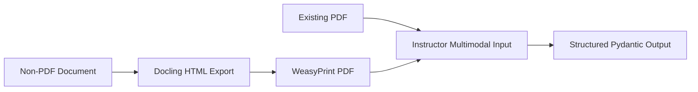

# Documents and Raw Text

Structx processes PDFs, office documents, markup, images, captions, and raw
strings through an optional multimodal document pipeline.

## Installation

```bash
pip install "structx[docs]"
```

The extra installs Docling Slim, its local model dependencies, PyTorch,
Torchvision, and WeasyPrint. Linux environments managed by this repository use
the CPU-only PyTorch index.

The base installation does not process document paths or raw strings. It does
support structured files, DataFrames, and lists of dictionaries.

## Pipeline


```mermaid
graph LR
    A[Existing PDF] --> D[Instructor Multimodal Input]
    B[Non-PDF Document] --> C[Docling HTML Export]
    C --> E[WeasyPrint PDF]
    E --> D
    D --> F[Structured Pydantic Output]
```

1. Existing PDFs are validated and passed through unchanged.
2. Other accepted document types are parsed once by Docling.
3. Docling HTML is rendered to a temporary PDF with WeasyPrint.
4. Docling's text export is retained as the schema-planning sample.
5. The PDF is sent to the extraction model through Instructor's multimodal
   support.

OCR and Docling table-structure analysis are disabled. The multimodal model is
responsible for interpreting the visual PDF content.

See [Supported Formats](../reference/supported-formats.md) for the complete
extension list.

## PDF and Office Documents

```python
# Existing PDF passthrough
invoice = extractor.extract(
    data="scripts/example_input/S0305SampleInvoice.pdf",
    query="extract the invoice number, total amount, and line items",
)

# DOCX conversion to PDF
agreement = extractor.extract(
    data="scripts/example_input/free-consultancy-agreement.docx",
    query="extract the parties, effective date, and payment terms",
)

# PowerPoint conversion to PDF
presentation = extractor.extract(
    data="quarterly_review.pptx",
    query="extract key metrics, decisions, and action items",
)
```

## Text and Markup Files

Text, Markdown, HTML, XML, source-code, and log paths use the same conversion
pipeline:

```python
result = extractor.extract(
    data="system.log",
    query="extract error events, timestamps, severity, and resolutions",
)
```

## Raw Strings

A non-empty string that does not look like a path is written to a temporary
`.txt` file and passed through the document pipeline:

```python
text = """
Incident 2024-001 occurred at 09:30 on the billing service.
The issue was resolved at 10:15 after a configuration rollback.
"""

result = extractor.extract(
    data=text,
    query="extract the incident ID, service, timestamps, and resolution",
)
```

Strings with supported file extensions, absolute paths, or prefixes such as
`./`, `../`, and `~/` are treated as file paths. A missing path is rejected
before planning or extraction.

To process text without the document extra, place it in a DataFrame or list of
dictionaries:

```python
import pandas as pd

data = pd.DataFrame({"text": ["Incident 2024-001 occurred at 09:30."]})
result = extractor.extract(data=data, query="extract incident ID and time")
```

## Structured Reader Options

`file_options` is forwarded only to pandas readers for structured formats:

```python
result = extractor.extract(
    data="events.csv",
    query="extract critical events",
    file_options={"encoding": "utf-8", "sep": ";"},
)
```

It does not configure Docling or multimodal extraction.

## Large Documents

Structx sends each PDF as a single multimodal input and does not chunk document
content. Provider context limits, upload limits, latency, and output limits
still apply. Split very large source documents before extraction when they
exceed the selected model or provider limits.

For a large output schema, configure an appropriate provider-specific output
limit under the `extraction` group:

```python
extractor = Extractor.from_litellm(
    model="openai/gpt-5.5",
    config={"extraction": {"max_completion_tokens": 16000}},
)
```

## Troubleshooting

### Missing document dependencies

Install or synchronize the document extra:

```bash
pip install "structx[docs]"
```

### Conversion failures

Confirm the source file is non-empty and uses an extension listed in
[Supported Formats](../reference/supported-formats.md). Existing PDFs must have
a valid PDF header; generated PDFs are also checked before extraction begins.

### Debug logging

```python
import sys

from loguru import logger

logger.remove()
logger.add(sys.stderr, level="DEBUG")
```

## Next Steps

- Use [Custom Models](custom-models.md) for a stable output schema.
- Review [Configuration Options](../reference/configuration-options.md) for
  planning and extraction model parameters.
- See [Error Handling](../reference/error-handling.md) for input and batch
  failure behavior.
