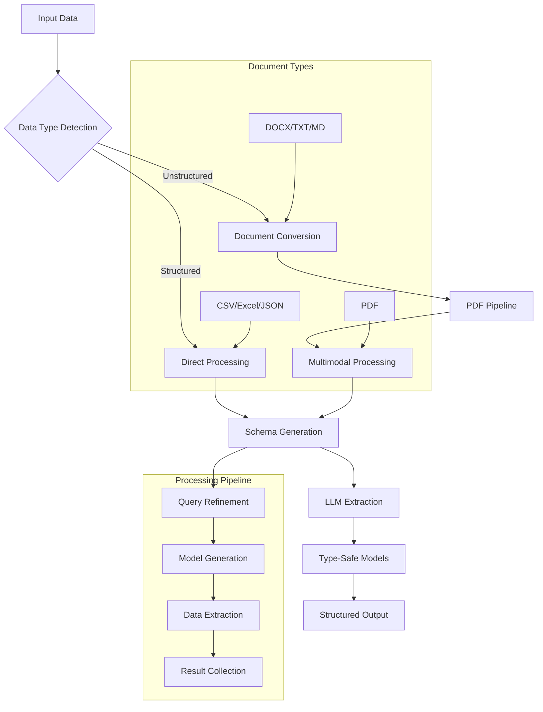

# structx

<div class="grid cards" markdown>

- :material-text-box-search-outline: **Structured Data Extraction**

  Extract structured data from unstructured text using LLMs with multimodal
  support

- :material-code-json: **Dynamic Model Generation**

  Automatically generate type-safe Pydantic models from natural language

- :material-file-document-multiple: **Advanced Document Processing**

  Unified PDF conversion pipeline for optimal extraction from any document
  format

- :material-lightning-bolt: **Multimodal Capabilities**

  Native instructor multimodal support with automatic PDF conversion

</div>

## Overview

`structx` is a powerful Python library that extracts structured data from text
using Large Language Models (LLMs). It dynamically generates type-safe data
models and provides consistent, structured extraction with support for complex
nested data structures.

Whether you're analyzing incident reports, processing documents, or extracting
metrics from unstructured text, `structx` provides a simple, consistent
interface with powerful capabilities.

### How structx Works



## Key Features

- 🔄 **Dynamic Model Generation**: Create type-safe models from natural language
  queries
- 🎯 **Intelligent Schema Inference**: Automatic schema generation and
  refinement
- 📊 **Complex Data Structures**: Support for nested and hierarchical data
- 🔄 **Natural Language Refinement**: Improve models with conversational
  instructions
- � **Multimodal Document Processing**: Advanced PDF conversion pipeline for any
  document format
- 🖼️ **Vision-Enabled Extraction**: Native instructor multimodal support for
  PDFs
- 🚀 **High-Performance Processing**: Multi-threaded and async operations
- ⚡ **Smart Format Detection**: Automatic processing mode selection
- 🔧 **Flexible Configuration**: Configurable extraction using OmegaConf
- 📁 **Universal File Support**: CSV, Excel, JSON, Parquet, PDF, DOCX, TXT, and
  more
- 🏗️ **Type Safety**: Type-safe data models using Pydantic
- 🎮 **Simple Interface**: Easy-to-use API with powerful capabilities
- 🔌 **Multiple LLM Providers**: Support through litellm integration
- 🔄 **Robust Error Handling**: Automatic retry mechanism with exponential
  backoff

## Installation

```bash
pip install structx-llm
```

For PDF support:

```bash
pip install structx-llm[pdf]
```

For DOCX support:

```bash
pip install structx-llm[docx]
```

For all document formats:

```bash
pip install structx-llm[docs]
```

## Quick Example

```python
from structx import Extractor

# Initialize extractor
extractor = Extractor.from_litellm(
    model="gpt-4o-mini",
    api_key="your-api-key"
)

# Extract structured data
result = extractor.extract(
    data="incident_report.txt",
    query="extract incident dates, affected systems, and resolution steps"
)

# Access the extracted data
print(f"Extracted {result.success_count} items")
for item in result.data:
    print(f"Date: {item.incident_date}")
    print(f"System: {item.affected_system}")
    print(f"Resolution: {item.resolution_steps}")
```

## License

This project is licensed under the MIT License - see the
[LICENSE](https://github.com/blacksuan19/structx/blob/master/LICENSE) file for
details.
