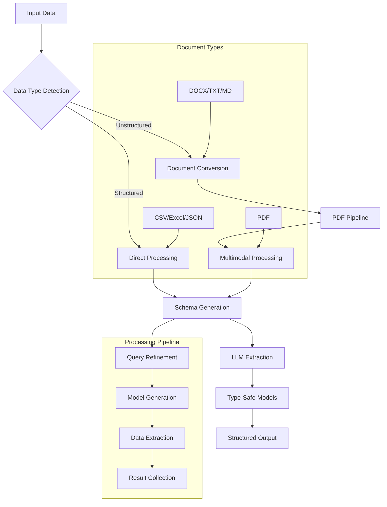

# structx

<div class="grid cards" markdown>

- :material-text-box-search-outline: **Structured Data Extraction**

  Extract structured data from unstructured text using LLMs with multimodal
  support

- :material-code-json: **Dynamic Model Generation**

  Automatically generate type-safe Pydantic models from natural language

- :material-file-document-multiple: **Advanced Document Processing**

  Unified PDF conversion pipeline for optimal extraction from any document
  format

- :material-lightning-bolt: **Multimodal Capabilities**

  Native instructor multimodal support with automatic PDF conversion

</div>

## Overview

`structx` is a powerful Python library for extracting structured data from
complex documents like legal agreements, financial reports, and invoices using
Large Language Models (LLMs). It excels at parsing unstructured and
semi-structured formats by leveraging a multimodal approach, ensuring high
accuracy and context preservation.

Whether you're digitizing receipts, analyzing contracts, or extracting key
information from any document, `structx` provides a simple, consistent interface
with powerful capabilities.

!!! info "Package rename notice (PyPI)" The PyPI distribution has been renamed
from `structx-llm` to `structx` (September 2025).

    - Imports are unchanged: `import structx`
    - Extras are unchanged: `structx[docs]`, `structx[pdf]`, `structx[docx]`
    - To upgrade:

      ```bash
      pip uninstall -y structx-llm
      pip install -U structx
      ```

    If you pinned `structx-llm` in requirements or lock files, replace it with `structx`.

### How structx Works

<details>
<summary>View Diagram of How structx Works</summary>



</details>

## Key Features

- 🔄 **Dynamic Model Generation**: Create type-safe models from natural language
  queries
- 🎯 **Intelligent Schema Inference**: Automatic schema generation and
  refinement
- 📊 **Complex Data Structures**: Support for nested and hierarchical data
- 🔄 **Natural Language Refinement**: Improve models with conversational
  instructions
- � **Multimodal Document Processing**: Advanced PDF conversion pipeline for any
  document format
- 🖼️ **Vision-Enabled Extraction**: Native instructor multimodal support for
  PDFs
- 🚀 **High-Performance Processing**: Multi-threaded and async operations
- ⚡ **Smart Format Detection**: Automatic processing mode selection
- 🔧 **Flexible Configuration**: Configurable extraction using OmegaConf
- 📁 **Universal File Support**: CSV, Excel, JSON, Parquet, PDF, DOCX, TXT, and
  more
- 🏗️ **Type Safety**: Type-safe data models using Pydantic
- 🎮 **Simple Interface**: Easy-to-use API with powerful capabilities
- 🔌 **Multiple LLM Providers**: Support through litellm integration
- 🔄 **Robust Error Handling**: Automatic retry mechanism with exponential
  backoff

## Installation

```bash
pip install structx
```

For PDF support:

```bash
pip install structx[pdf]
```

For DOCX support:

```bash
pip install structx[docx]
```

For all document formats:

```bash
pip install structx[docs]
```

## API Requirements

**Important**: All extractor methods use **keyword-only arguments**. You must
specify parameter names explicitly:

```python
# ✅ Correct
result = extractor.extract(data="document.pdf", query="extract data")

# ❌ Incorrect
result = extractor.extract("document.pdf", "extract data")  # Will raise TypeError
```

## Quick Example

```python
from structx import Extractor

# Initialize extractor
extractor = Extractor.from_litellm(
    model="gpt-4o",
    api_key="your-api-key"
)

# Extract from a legal agreement
result = extractor.extract(
    data="scripts/example_input/free-consultancy-agreement.docx",
    query="extract the parties, effective date, and payment terms"
)

# Access the extracted data
for item in result.data:
    print(f"Parties: {item.parties}")
    print(f"Effective Date: {item.effective_date}")
    print(f"Payment Terms: {item.payment_terms}")

# Extract from a PDF invoice
result = extractor.extract(
    data="scripts/example_input/S0305SampleInvoice.pdf",
    query="extract the invoice number, total amount, and line items"
)

# Access the extracted data
for item in result.data:
    print(f"Invoice Number: {item.invoice_number}")
    print(f"Total Amount: {item.total_amount}")
    print(f"Line Items: {item.line_items}")
```

## License

This project is licensed under the MIT License - see the
[LICENSE](https://github.com/blacksuan19/structx/blob/master/LICENSE) file for
details.
